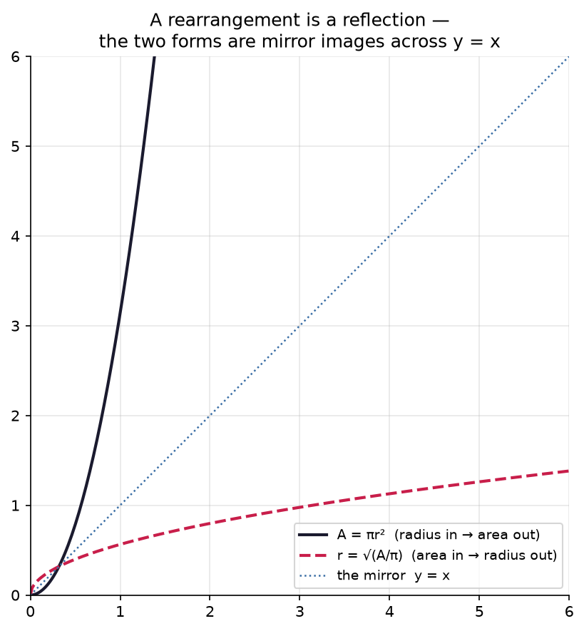

# 0.2 — Rearranging for ANY Symbol

*≤5 min read. Then straight to the worksheet.*

## Why this matters (the real reason)

Open any ML paper and you'll find formulas made of pure symbols: $\eta_t = \eta_0 e^{-kt}$
(a learning-rate schedule), $w \leftarrow w - \eta \nabla L$ (the update rule that trains every
neural net). Nobody hands you numbers. Reading these means being able to grab **any symbol**
and drag it into the spotlight: *"okay, but what does this say about $\eta$?"*
That's not a new skill. It's the balance game from 0.1 — with the training wheels
(the numbers) removed. **This is 90% of what reading ML papers requires.**

## The one big idea

**Every symbol you're not solving for is just a number you don't happen to know yet.**

Solve $3x = 12$: divide both pans by 3. Now solve $at = v$ for $a$: divide both pans by $t$.
Identical move. The $t$ is playing the role the 3 played.

$$v = at$$
$$\frac{v}{t} = a \qquad \leftarrow \text{move: divide both pans by } t \; (t \neq 0)$$

The "answer" is no longer a number like $x = 4$ — it's an **expression**: $a = \frac{v}{t}$.
That's still an answer. It says: *whatever $v$ and $t$ turn out to be, $a$ is their ratio.*

## Watch one game get played

Solve $A = \pi r^2$ for $r$ (given the area of a circle, how big is its radius?):

$$A = \pi r^2$$
$$\frac{A}{\pi} = r^2 \qquad \leftarrow \text{move: divide both pans by } \pi$$
$$\sqrt{\frac{A}{\pi}} = r \qquad \leftarrow \text{move: square-root both pans}$$

One new legal move appeared: **square-root both sides**. It's legal for the same reason as the
others — do it to both pans, balance holds. (One caution: $r^2 = 9$ has *two* candidates,
$3$ and $-3$. Here a radius can't be negative, so we keep the positive root. Always ask
which roots make sense.)

Same strategy as 0.1: **peel away whatever is furthest from your target, one legal move
at a time** — even when everything is a symbol.

And here's what rearranging *looks* like. $A = \pi r^2$ and its rearrangement $r = \sqrt{A/\pi}$
are the same relationship read two ways — so their graphs are mirror images:



*Rearranging for the other symbol **flips the graph across the diagonal** $y=x$ — inputs and outputs
swap seats. Radius-in-area-out becomes area-in-radius-out. The relationship never changed; you just
chose which variable stands in the spotlight. (This is the deep-end question below, already answered:
no single form is more "true" — they're one truth seen from different sides.)*

| Situation | Move that undoes it |
|---|---|
| target has something added: $x + b$ | subtract $b$ from both |
| target is multiplied: $mx$ | divide both by $m$ |
| target is in the basement: $\frac{k}{x}$ | multiply both by $x$ first, then re-solve |
| target is squared: $x^2$ | square-root both (mind the $\pm$) |

## The Python connection

A rearrangement is just **the same function written to return a different variable**:

```python
def v_from(a, t):          # v = a*t   (the formula as given)
    return a * t

def a_from(v, t):          # a = v/t   (your rearrangement)
    return v / t

# Check the rearrangement with random numbers — if the algebra is legal,
# going forwards then backwards must land where you started:
a, t = 2.5, 4.0
v = v_from(a, t)
print(a_from(v, t) == a)   # True → the rearrangement is sound
```

That's the answer to worksheet 0.1's bonus question: **no numbers? invent some.**
A legal rearrangement survives *any* numbers you throw at it.

## What breaks the balance (the classic traps)

- **Dividing by a symbol that might be zero.** $\frac{v}{t}$ is meaningless if $t = 0$.
  Note the assumption ($t \neq 0$) and move on — papers do this constantly.
- **Moving only part of a side.** In $y = mx + b$, solving for $x$: subtract $b$ from the
  *whole* right side first. You can't divide by $m$ while $b$ is still sitting there —
  a move applies to the ENTIRE pan.
- **Square-rooting and forgetting $\pm$.** $x^2 = 25$ means $x = 5$ *or* $x = -5$,
  unless context rules one out.

> **Deep-end question to hold in your head during the worksheet:**
> $y = mx + b$ can be rearranged for $m$, for $x$, or for $b$ — three different spotlights
> on one relationship. Is any one of the four forms more "true" than the others?
> Then what *is* the equation, really?

**Now: worksheet `02-rearranging-any-symbol` — pen and paper. Photograph it into `scans/inbox/` when done.**
