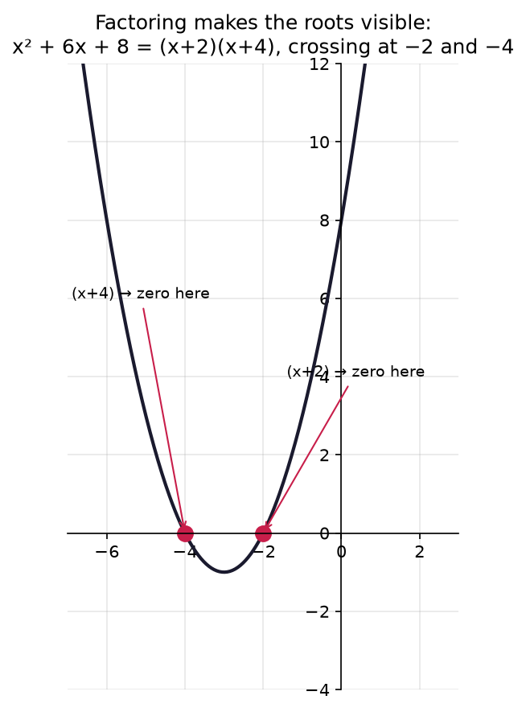

# 0.3 — Expand & Factor: Same Expression, Different Shapes

*≤5 min read. Then straight to the worksheet.*

## Why this matters (the real reason)

This unit is the old wound. School said "simplify first, then solve" and never explained
what "simplify" meant — so any equation that needed **restructuring** before your recipes
applied felt like a locked door. Here's the secret nobody said out loud:
$2(x+3)$ and $2x+6$ are **the same expression wearing different outfits**. Expanding and
factoring don't change what an expression *is* — they change its **shape**, and different
shapes make different moves available. When an ML derivation "simplifies" a loss function
across three lines, it's doing exactly this: reshaping until the useful structure shows.
Learn the reshape moves and the locked door opens.

## The one big idea

One law powers everything — the **distributive law**:

$$a(b + c) = ab + ac$$

Why is it true? Count tiles. A rectangle $a$ tall and $(b+c)$ wide is just two rectangles
side by side: one $a \times b$, one $a \times c$. Same tiles, sliced differently.

Read it **left-to-right** and you're **expanding** (multiplying out the brackets).
Read it **right-to-left** and you're **factoring** (pulling out what's common).
One law, two directions. That's the whole unit.

Two brackets? Distribute twice — every term in the first bracket shakes hands with every
term in the second:

$$(x+2)(x+3) = x \cdot x + x \cdot 3 + 2 \cdot x + 2 \cdot 3 = x^2 + 5x + 6$$

## Watch one game get played

Solve $x^2 + 5x + 6 = 0$. No balance move from 0.1 or 0.2 can pry $x$ out of this —
it appears twice, tangled up. The equation needs **restructuring first**:

$$x^2 + 5x + 6 = 0$$
$$(x+2)(x+3) = 0 \qquad \leftarrow \text{move: factor (which two numbers add to } 5\text{, multiply to } 6\text{?)}$$
$$x + 2 = 0 \;\text{ or }\; x + 3 = 0 \qquad \leftarrow \text{move: zero product — if two things multiply to } 0\text{, one IS } 0$$
$$x = -2 \;\text{ or }\; x = -3 \qquad \leftarrow \text{move: subtract from both pans (0.1 takes it home)}$$

*That* is why factoring exists: the factored shape unlocks a move (zero product) that the
expanded shape hides. **Reshape until a move you know applies.** This sentence is the fix
for the old wound.

The factored form isn't just convenient — it's *readable off the graph*:



*A parabola's **roots** are where it crosses the floor ($y=0$). The factored form
$(x+2)(x+4)$ hands them to you for free: $(x+2)$ says "zero at $x=-2$", $(x+4)$ says "zero at
$x=-4$". The expanded form $x^2+6x+8$ hides them completely. Same curve, but only one shape lets you
read the answers straight off — that's what "different shapes make different moves available" means.*

| Shape | Good for |
|---|---|
| Expanded: $x^2 + 5x + 6$ | adding to other expressions, comparing coefficients |
| Factored: $(x+2)(x+3)$ | solving $= 0$, spotting roots, cancelling fractions |

## The Python connection

sympy has both moves built in — and their names are exactly the words we've been using:

```python
import sympy as sp
x = sp.symbols("x")

print(sp.expand((x + 2) * (x + 3)))    # x**2 + 5*x + 6
print(sp.factor(x**2 + 5*x + 6))       # (x + 2)*(x + 3)
```

`expand` and `factor` are inverse reshapes — run one after the other and you're back where
you started. Use them to referee every paper answer on the worksheet.

## What breaks the balance (the classic traps)

- **The freshman's dream:** $(a+b)^2 \neq a^2 + b^2$. Expand it properly:
  $(a+b)(a+b) = a^2 + 2ab + b^2$. That middle term $2ab$ is the handshake people forget.
- **Dropped negatives:** $-2(x - 5) = -2x + 10$, not $-2x - 10$.
  The $-2$ distributes onto *every* term, minus signs included.
- **Half a distribution:** $3(x + 4) \neq 3x + 4$. Everyone in the bracket gets multiplied.

> **Deep-end question to hold in your head during the worksheet:**
> the zero-product move works because the right side is $0$. If $(x+2)(x+3) = 6$,
> can you conclude $x+2 = 6$ or $x+3 = 6$? Why is zero special?

**Now: worksheet `03-expand-and-factor` — pen and paper. Photograph it into `scans/inbox/` when done.**
