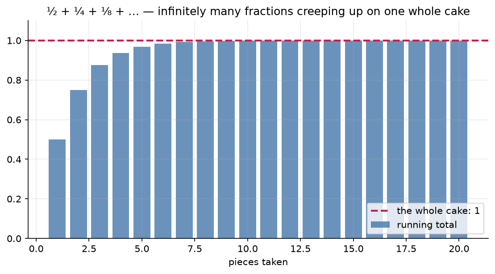

# 0.4 — Fractions, Ratios & Percentages

*≤5 min read. Then straight to the worksheet.*

## Why this matters (the real reason)

ML runs on fractions. Normalising an image means dividing every pixel by 255. A probability
*is* a fraction: $\frac{\text{ways it happens}}{\text{all the ways}}$. An 80/20 train/test
split, a softmax turning scores into percentages, accuracy = correct/total — all of it is
this unit. And the single most common data-prep move in the field — *divide everything by
the total so it sums to 1* — is about to become obvious to you instead of mysterious.

## The one big idea

**A fraction is a division you haven't done yet.** $\frac{3}{4}$ *is* $3 \div 4$ *is* $0.75$
*is* $75\%$ — four costumes, one number.

Everything else follows from one legal move you already own: **multiplying by 1 changes
nothing**. Since $\frac{5}{5} = 1$:

$$\frac{3}{4} = \frac{3}{4} \times \frac{5}{5} = \frac{15}{20}$$

Same number, new denominator. That single trick explains the rules school made you memorise:

| Rule | Why it works |
|---|---|
| $\frac{a}{b} \times \frac{c}{d} = \frac{ac}{bd}$ | "a fraction *of* a fraction" — take $\frac{3}{4}$ of a half: slice the slice |
| $\frac{a}{b} \div \frac{c}{d} = \frac{a}{b} \times \frac{d}{c}$ | dividing by $\frac{1}{2}$ asks "how many halves fit?" — twice as many as wholes |
| $\frac{a}{b} + \frac{c}{d}$ needs a common denominator | you can only add matching pieces — quarters with quarters, not quarters with thirds |
| $x\%$ of $y$ = $\frac{x}{100} \times y$ | "per cent" literally means "per hundred" |

## Watch one game get played

Three models score $12$, $8$ and $4$ on some benchmark. Turn the scores into
**proportions** (a mini-softmax, the same idea inside every classifier):

$$\text{total} = 12 + 8 + 4 = 24 \qquad \leftarrow \text{move: sum everything}$$
$$\frac{12}{24},\; \frac{8}{24},\; \frac{4}{24} \qquad \leftarrow \text{move: divide each by the total (normalise)}$$
$$\frac{1}{2},\; \frac{1}{3},\; \frac{1}{6} \qquad \leftarrow \text{move: cancel common factors (dividing by } \tfrac{12}{12} = 1\text{)}$$

Check: $\frac{1}{2} + \frac{1}{3} + \frac{1}{6} = \frac{3}{6} + \frac{2}{6} + \frac{1}{6} = \frac{6}{6} = 1$
$\leftarrow$ *move: rewrite over common denominator, then add tops.*
Normalised numbers **always** sum to 1 — that's what makes them a probability distribution.

And "summing to 1" can be a beautiful thing to watch. Take half a cake, then half of what's left,
then half of *that*, forever:



*Infinitely many fractions — $\tfrac12 + \tfrac14 + \tfrac18 + \cdots$ — and their running total creeps
up on **exactly 1**, never overshooting. Each piece covers half the remaining gap, so you close in on
the whole cake without ever passing it. Adding forever needn't blow up; sometimes it settles on a
number. That quiet idea (a "convergent series") is the seed of the calculus in Module 3.*

## The Python connection

```python
scores = [12, 8, 4]
total = sum(scores)                    # sum() adds up a list

# a "list comprehension" — Python's one-line way to transform every item:
props = [s / total for s in scores]    # read: "s/total, for each s in scores"
print(props)                            # [0.5, 0.333..., 0.1666...]
print(sum(props))                       # 1.0 — always, by construction
```

You'll write that exact `s / total` line hundreds of times in ML. Now you know *why* it
guarantees a sum of 1: $\frac{12}{24} + \frac{8}{24} + \frac{4}{24} = \frac{12+8+4}{24} = \frac{24}{24}$.

## What breaks the balance (the classic traps)

- **Adding tops AND bottoms:** $\frac{1}{2} + \frac{1}{3} \neq \frac{2}{5}$.
  (Sanity check: the "answer" $\frac{2}{5}$ is *smaller* than $\frac{1}{2}$ — adding something
  positive made it shrink? Broken.)
- **Percentages don't undo symmetrically:** up 50% then down 50% is *not* back to start —
  $100 \to 150 \to 75$. The second 50% is of a *different* number.
- **Cancelling across a + sign:** $\frac{x + 4}{4} \neq x$. You can only cancel
  **factors** (things multiplied), never **terms** (things added) — this is 0.3's
  expand/factor distinction earning its keep.

> **Deep-end question to hold in your head during the worksheet:**
> dividing by $\frac{1}{2}$ *doubles* a number. So what should dividing by $0.0001$ do?
> And what does that suggest about why dividing by zero is banned rather than just "undefined by decree"?

**Now: worksheet `04-fractions-ratios-percentages` — pen and paper. Photograph it into `scans/inbox/` when done.**
