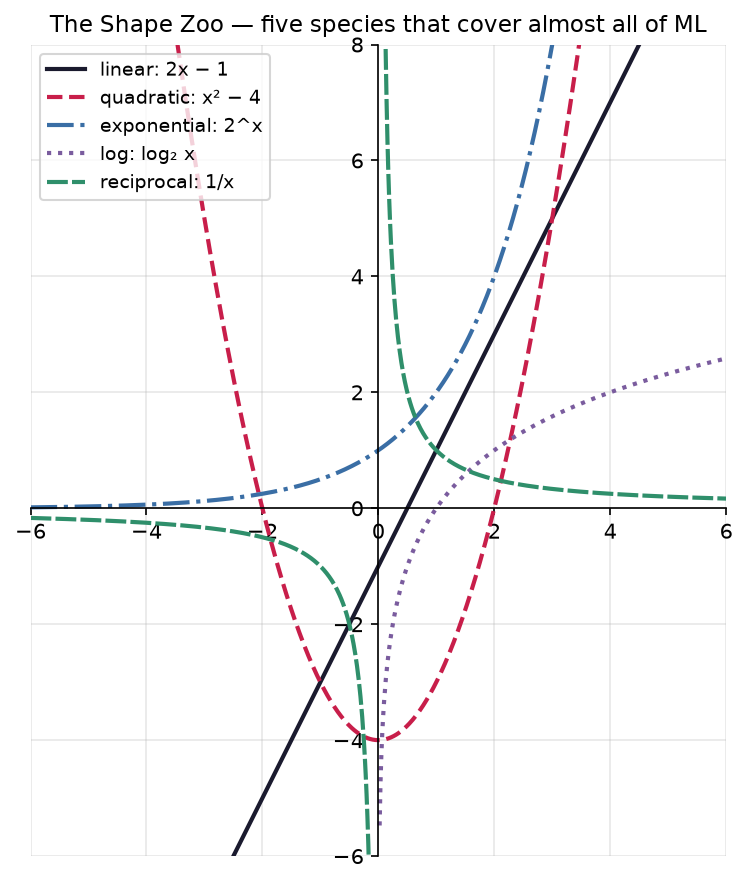
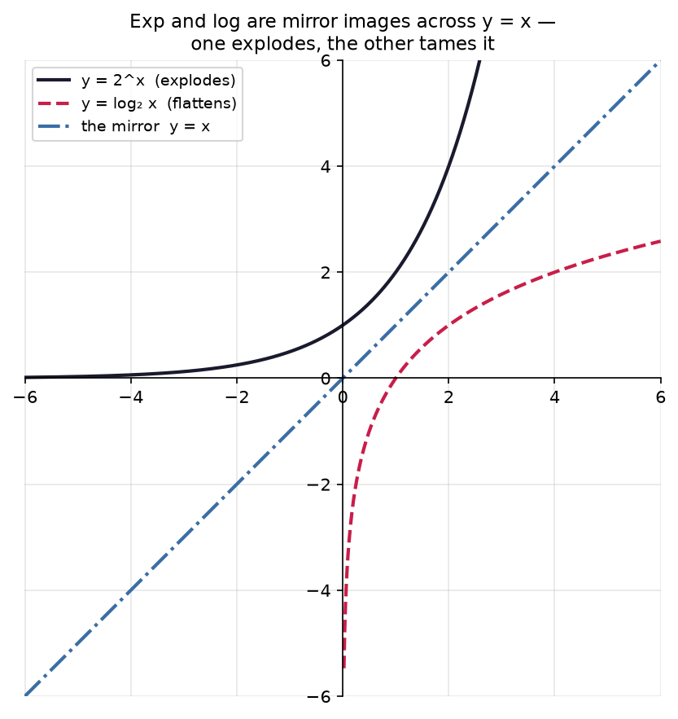
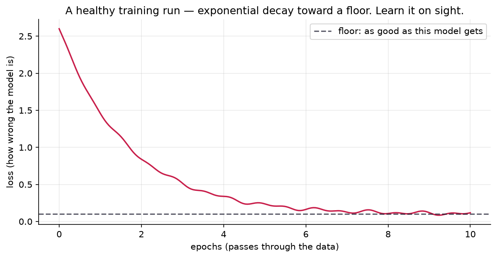

# 1.2 — The Shape Zoo

*≤5 min read. Then straight to the worksheet.*

## Why this matters (the real reason)

When you train a model, the single most important picture in your life is the **loss curve** —
error plotted over time. Experienced ML people glance at one and instantly diagnose:
"healthy decay", "learning rate too high", "it's plateaued". They can do that because they know
five graph shapes the way you know faces. This unit teaches you those five faces.

## The one big idea

Five species cover almost everything you'll meet in ML. Learn each one's **equation form**,
its **shape**, and its **one-word personality**:

| Species | Blueprint | Shape | Personality | Where it lives in ML |
|---|---|---|---|---|
| Linear | $y = mx + b$ | straight line | steady | a neuron before activation; trends |
| Quadratic | $y = x^2$ | valley (parabola) | has a bottom | loss surfaces; mean-squared error |
| Exponential | $y = 2^x,\; e^x$ | hockey stick | explosive | compound growth; $e^{-x}$ = decay schedules |
| Logarithm | $y = \log x$ | fast rise, then flattens | diminishing | log-probabilities; "log loss" |
| Reciprocal | $y = \frac{1}{x}$ | two swooping branches | blows up near 0 | $\frac{1}{n}$ averaging; LR schedules |



*The whole zoo in one enclosure. Don't memorise points — memorise **silhouettes**. The straight
line, the U-valley, the hockey-stick explosion, the slow-rising log, the two swooping reciprocal
branches. Notice the log and reciprocal curves have **gaps** — those aren't drawing errors, they're
the domain crashers from 1.1 made visible (log dies at $x\le0$, $1/x$ blows up at $0$).*

Key field marks for spotting each in the wild:

- **Linear**: constant slope $m$; crosses the $y$-axis at $b$. No curve at all.
- **Quadratic**: symmetric valley; bottom (the *vertex*) at $x=0$ for plain $x^2$; both far ends go up.
- **Exponential $2^x$**: crosses $y$-axis at 1 (because $2^0 = 1$); hugs zero on the left
  (an **asymptote** — a line the graph approaches forever but never touches); rockets on the right.
- **Log**: only exists for $x > 0$ (remember the domain crashers); crosses the $x$-axis at 1;
  keeps rising forever, just ever more slowly.
- **$\frac{1}{x}$**: crashes at $x = 0$, so the graph splits into two branches; both axes are asymptotes.

## The exp/log mirror

$\log_2 x$ answers "2 to the power of *what* gives $x$?" — it's $2^x$ with question and answer
swapped. Their graphs are mirror images across the diagonal line $y = x$. One explodes, the other
flattens. That's why logs appear in loss functions: they *tame* explosive quantities.



*The same mirror you met in Module 0.2 (rearranging swaps input and output), now between the two
loudest zoo animals. Fold the page along $y=x$ and the explosion lands exactly on the flattening
curve. A log is an exponential run backwards — which is precisely why it defuses explosive numbers.*

## Worked example: predict before you plot

Predict the shape of $y = 2^{-x}$ before reading on.

It's exponential ($x$ in the exponent), but the $-x$ runs it backwards: huge on the left, and as
$x$ grows, $2^{-x} = \frac{1}{2^x}$ shrinks toward 0 without touching it. A falling slide that
flattens along the floor. **That is the classic healthy loss curve** — error decaying toward zero.
When you watch a model train, you're watching $e^{-x}$ happen.



*Here's one in the wild (with the little measurement wobble real runs always have). This is the
picture you'll stare at more than any other in ML. You can now name its species on sight —
exponential decay toward an asymptote — and the dashed floor is "as good as this model gets".
Diagnosing training runs starts with recognising this silhouette and noticing when it's **wrong**.*

## The Python connection

You'll graph every species yourself in the notebook using `np.linspace` + matplotlib.
The zoo in code:

```python
lambda x: 3*x + 1      # linear      (lambda = a one-line unnamed def; more in the notebook)
lambda x: x**2         # quadratic   (** is power, NOT ^)
lambda x: 2**x         # exponential
np.log                 # natural log (base e — ML's default log)
lambda x: 1/x          # reciprocal
```

## Classic traps

- **$x^2$ vs $2^x$.** Looks like a typo, is a species barrier. *Where is the $x$?* Base → polynomial
  valley. Exponent → explosion. For big $x$, $2^x$ obliterates $x^2$ (check: $x=10$ gives 100 vs 1024).
- **"Log flattens out."** It never does — it grows forever, just glacially. $\log_2 x$ reaches 20…
  when $x$ is a million. Slow ≠ stopped.
- **Sketching $\frac{1}{x}$ as one connected curve.** It can't cross $x=0$ (crash!). Two separate branches, always.

> **Deep-end question to hold in your head during the worksheet:**
> a training-loss curve drops fast then levels off — shaped like $e^{-x}$. An accuracy curve rises
> fast then levels off — shaped like… which zoo animal, transformed how? Could *both* curves be the
> same species wearing different disguises?

**Now: worksheet `02-shape-zoo` — pen and paper. Sketch first, matplotlib later. Photograph into `scans/inbox/`.**
