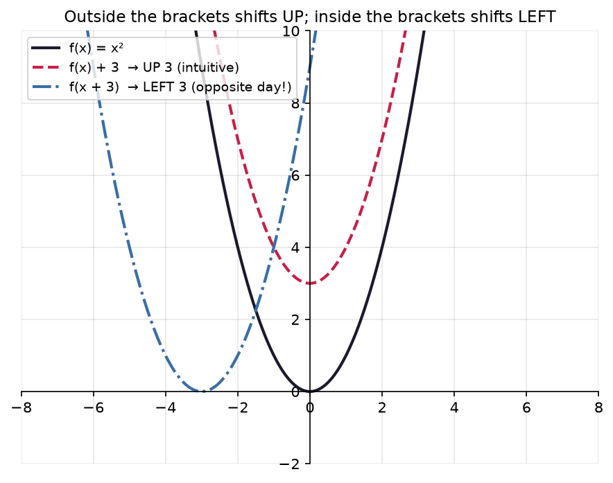
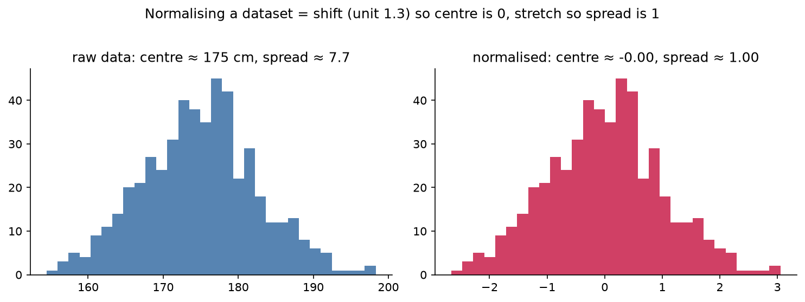

# 1.3 — Transforming Graphs

*≤5 min read. Then straight to the worksheet.*

## Why this matters (the real reason)

Inside a neural network, a "neuron" computes $w \cdot x + b$: multiply the input by a **weight**,
add a **bias**. That's it. Multiply and add. This unit is about what multiply-and-add *does to a
graph* — stretch it, shift it, flip it. When you normalise data ($z = \frac{x - \mu}{\sigma}$:
shift, then stretch), you're doing graph transformations to your whole dataset. Weights and biases
aren't mysterious: they're the four moves below, learned automatically.

## The one big idea

Take any machine $f$ from the zoo. Every transformation is either done to its **output**
(after the machine → vertical, behaves intuitively) or to its **input** (before the machine →
horizontal, behaves *backwards*):

| Move | New blueprint | What the graph does | Intuitive? |
|---|---|---|---|
| add to output | $f(x) + c$ | shifts **up** by $c$ | ✓ yes |
| multiply output | $a \cdot f(x)$ | stretches **vertically** ×$a$ | ✓ yes |
| flip output | $-f(x)$ | flips **upside down** (over $x$-axis) | ✓ yes |
| add to input | $f(x + c)$ | shifts **LEFT** by $c$ | ✗ backwards! |
| multiply input | $f(ax)$ | **squashes** horizontally ÷$a$ | ✗ backwards! |
| flip input | $f(-x)$ | flips **left-right** (over $y$-axis) | mirror |

**Why input moves run backwards:** $f(x+3)$ at $x = 2$ computes $f(5)$ — it *pre-fetches* the
output that used to live at 5 and displays it at 2. Everything arrives 3 early → the whole graph
slides 3 to the **left**. Outside the brackets: what you see is what you get. Inside the brackets:
opposite day.



*The whole lesson in one picture. $f(x)+3$ (change the **output**) lifts the parabola straight **up** —
exactly what you'd expect. $f(x+3)$ (change the **input**) slides it **left**, the "wrong" way. Stare
until "inside the brackets is opposite day" feels obvious, because this is the single most-failed idea
in school algebra — and it's really just the pre-fetch above, drawn.*

## Watch one build

Sketch $y = -(x - 3)^2 + 5$, starting from the zoo animal $y = x^2$:

1. $x \to x - 3$ (inside): shift **right** 3 — vertex now at $x = 3$
2. $-(\dots)$ (outside): flip upside down — valley becomes a hill
3. $+\,5$ (outside): shift up 5 — peak sits at $(3, 5)$

A hill topping out at $(3, 5)$. Three legal moves, fully predictable — no plotting-by-table needed,
ever again. (Same spirit as Module 0: not recipes, *moves*.)

## The Python connection

Transformations compose beautifully in code — this is the whole trick:

```python
f = lambda x: x**2                    # the base machine
g = lambda x: -f(x - 3) + 5           # transformed: right 3, flip, up 5
```

And normalisation, which you'll do to every dataset you ever train on:

```python
z = (x - mu) / sigma    # shift the data so its centre is 0, stretch so its spread is 1
```

Same moves, applied to data instead of a curve:



*500 people's heights, before and after normalising. **Same shape**, new home: the raw pile centred on
175 cm slides to centre **0** and squashes to spread **1**. That's just "shift then stretch" — this
lesson's moves — applied to a whole dataset instead of a single curve. Networks train far better on the
right-hand version, and now you know normalisation isn't a magic incantation, it's unit 1.3.*

## Classic traps

- **$f(x+2)$ shifts right.** No — **left**. Inside the brackets is opposite day. This is the
  single most-failed question in every algebra exam ever written.
- **Mixing up which moves touch asymptotes.** $2^x + 3$ lifts the whole graph, *asymptote included*
  (floor moves from $y=0$ to $y=3$). Vertical stretches leave a $y=0$ asymptote where it is —
  stretching zero gives zero.
- **Applying shift before stretch when the blueprint says otherwise.** $2f(x) + 3$ stretches first,
  *then* lifts. $2(f(x) + 3)$ lifts first, then stretches — and lands somewhere different. Brackets
  are the order of operations, same as Module 0.

> **Deep-end question to hold in your head during the worksheet:**
> $y = e^{x+1}$ is $e^x$ shifted left 1. But $e^{x+1} = e \cdot e^x$ (exponent rules, Module 0.5) —
> which is a *vertical stretch* by $e$. One graph, two true descriptions. What is it about $e^x$
> that lets a sideways move masquerade as a stretch? Would that work for $x^2$?

**Now: worksheet `03-transforming-graphs` — pen and paper, sketch first, verify in matplotlib after. Photograph into `scans/inbox/`.**
