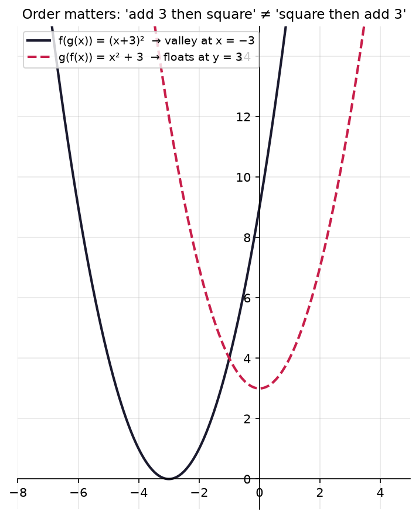
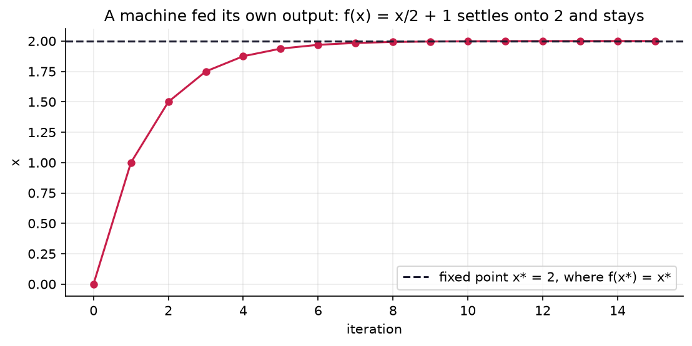
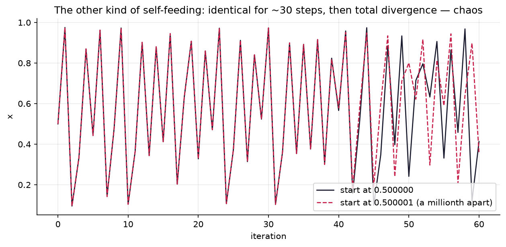

# 1.4 — Composing Functions: Machines Feeding Machines

*≤5 min read. Then straight to the worksheet.*

## Why this matters (the real reason)

You've heard "deep learning" a thousand times. Here's the secret: **"deep" just means "deeply
composed"**. A 50-layer network is 50 machines bolted output-to-input:
$f_{50}(f_{49}(\dots f_2(f_1(x))\dots))$. A "layer" IS one machine in the chain. When you finish
this unit, the architecture diagrams in every ML paper stop being boxes-and-arrows mysticism and
become something you learned today: composition.

## The one big idea

Bolt two machines together: the output chute of $g$ empties into the input slot of $f$.

$$f(g(x)) \qquad \text{— read inside-out: } x \text{ enters } g \text{ FIRST, then } f$$

With $g(x) = x + 3$ and $f(x) = x^2$:

$$f(g(2)) = f(5) = 25 \qquad \text{but} \qquad g(f(2)) = g(4) = 7$$

**Order matters.** $f(g(x))$ and $g(f(x))$ are different machines. "Add 3 then square" ≠
"square then add 3" — exactly like Module 0's order of operations, but at machine scale.



*Same two machines, opposite plumbing, two genuinely different curves. Bolt them $g$-then-$f$ and the
valley slides **left** to $x=-3$; bolt them $f$-then-$g$ and the valley lifts **up** to $y=3$. If order
didn't matter these would be one curve — they plainly aren't. (Which is which? Unit 1.3 tells you before
the legend does.)*

## Building the combined blueprint

You can compute a composition's blueprint once and for all: feed the *entire* blueprint of $g$
into the slot of $f$ (whole, in brackets — the 1.1 rule):

$$f(g(x)) = f(x + 3) = (x+3)^2$$

And you can run it backwards — **decomposing** is the ML-reading superpower. See $h(x) = (2x-1)^3$
in a paper? Recognise it as a pipeline: *inner machine* $2x - 1$, *outer machine* $(\;)^3$.
Every gnarly formula is small machines in a trench coat.

## The Python connection

Composition is just calling a function on a function's result — you've probably already done it:

```python
def g(x): return x + 3
def f(x): return x ** 2

print(f(g(2)))    # 25 — g runs first, then f
print(g(f(2)))    # 7  — different machine!

# a "deep network" is literally this, repeated:
def network(x):
    return f3(f2(f1(x)))    # layer 1, then 2, then 3 — reading right to left
```

One notation gotcha: math writes $f(g(x))$ with $g$ *first in execution* but *second on the page*.
Pipelines run right-to-left in this notation. (Data people often draw it left-to-right as
$x \to g \to f$; same machine, friendlier arrow.)

## A whisper of what's coming

Module 3's headline act, the **chain rule**, answers: *if I wiggle the input of a pipeline, how
much does the final output wiggle?* Spoiler: each machine multiplies the wiggle, and the effects
**multiply down the chain**. That rule, applied to a deep network, is called **backpropagation** —
the algorithm that trains every model you've ever heard of. You now know the structure it runs on.

## Classic traps

- **Assuming $f(g(x)) = g(f(x))$.** Almost never true. Always check which machine eats first.
- **Feeding the blueprint in piecemeal.** $f(x+3)$ where $f(x)=x^2$ is $(x+3)^2$, not $x^2 + 3$.
  The entire input goes in the slot, bracketed.
- **Ignoring the middle domain.** $g$'s *output* must be a legal *input* for $f$. If
  $f(x) = \sqrt{x}$ and $g(x) = x - 5$, then $f(g(1)) = \sqrt{-4}$ — crash. A pipeline's domain
  is squeezed by every machine in it.

### 🌀 When a machine eats its own output

Feed a machine its own output, over and over — $f(f(f(\dots)))$. Two wildly different fates await:



*The calm case: $f(x)=\tfrac{x}{2}+1$ started at 0 creeps up and **parks at 2** forever, because
$f(2)=2$ — a "fixed point", where the machine stops changing anything. Obedient, predictable. Now watch
the other kind:*



*The wild case: $f(x)=3.9x(1-x)$, run from two starts a **millionth** apart. They agree for ~30 steps,
then diverge utterly. That's **chaos** — total sensitivity to the starting point — from a one-line
machine simpler than the calm one. Same idea (a machine eating its own output), opposite universe. It
has its own branch of maths, and its own Wonder Interlude waiting for you.*

> **Deep-end question to hold in your head during the worksheet:**
> compute $f(x) = \frac{x}{2} + 1$ from $x = 0$ by hand, five times, and watch it home in on 2.
> *Why* 2? Set $f(x^\*) = x^\*$ and solve — the fixed point is the answer to a Module 0 balance game.

**Now: worksheet `04-composing-functions` — pen and paper. Photograph into `scans/inbox/` when done.**
