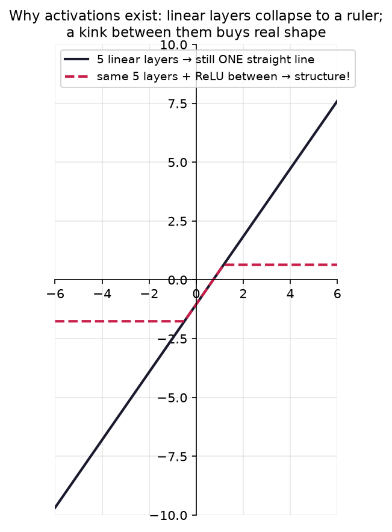
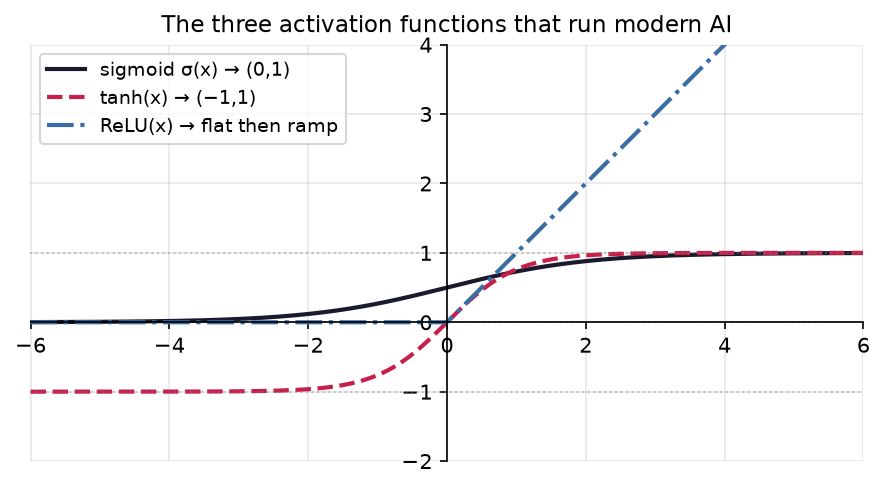
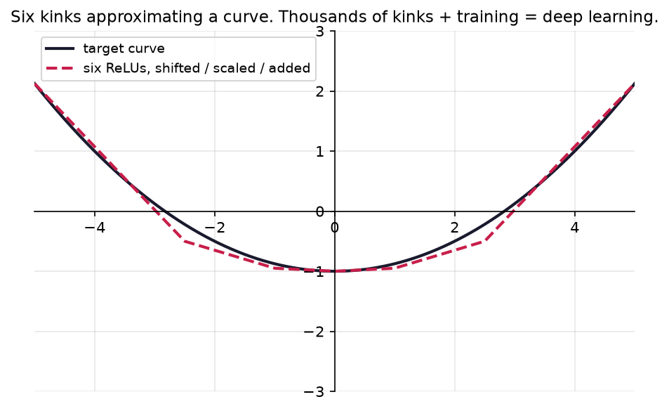

# 1.5 — Sigmoid & Friends

*≤5 min read. Then straight to the worksheet.*

## Why this matters (the real reason)

Last unit: deep learning = deeply composed machines. Here's the catch nobody mentions in the hype:
**compose linear machines and you get… a linear machine.** Watch — with $f(x) = 2x + 1$ and
$g(x) = 3x - 2$:

$$f(g(x)) = 2(3x - 2) + 1 = 6x - 3$$

Still a straight line. Stack a *hundred* linear layers and the whole tower collapses to one
$y = mx + b$ — a hundred layers with the power of one. A deep network of pure weights-and-biases
is an expensive ruler. The fix: slip a **nonlinear** machine between the linear ones. Those are the
**activation functions**, and you already know their species from the zoo.



*Proof the collapse is real. **Five** linear layers bolted together (dark line) produce a single
straight line — a ruler could do it, all that depth wasted. Slip a ReLU between each pair (red) and the
same five layers suddenly bend and carry structure. This one picture is *why activation functions
exist*: without a nonlinearity in the gaps, depth buys you nothing.*

## The one big idea

Three activation functions run essentially all of modern AI:

| Name | Blueprint | Output range | Shape | Job |
|---|---|---|---|---|
| Sigmoid | $\sigma(x) = \dfrac{1}{1 + e^{-x}}$ | $(0, 1)$ | S-curve | squash anything into a probability |
| Tanh | $\tanh(x)$ | $(-1, 1)$ | S-curve, centred on 0 | like sigmoid but zero-centred |
| ReLU | $\mathrm{ReLU}(x) = \max(0, x)$ | $[0, \infty)$ | flat, then ramp | the cheap, fast workhorse |

**Sigmoid is built entirely from zoo animals.** Read the blueprint inside-out (unit 1.4!):
$x \to e^{-x}$ (exponential decay) $\to 1 + e^{-x}$ (shift up 1) $\to \frac{1}{1+e^{-x}}$
(reciprocal). Three machines you already know, composed.



*The three of them, in person. **Sigmoid**: an S squashing everything into $(0,1)$, centred at
$(0,\tfrac12)$. **Tanh**: the same S but living in $(-1,1)$, centred on the origin. **ReLU**: dead flat
for negatives, then a straight ramp — with one all-important **kink** at 0. Note none of the S-curves
ever quite touch their ceilings or floors (asymptotes), just like $2^x$ hugging its floor back in 1.2.*

## Walk the S-curve

Trace $\sigma$ at three inputs — this is worth doing slowly, once:

- $x = 0$: $e^{0} = 1$, so $\sigma(0) = \frac{1}{1+1} = \frac{1}{2}$. Dead centre.
- $x$ huge (say 10): $e^{-10} \approx 0.00005$, so $\sigma \approx \frac{1}{1} = 1$. Almost — never exactly.
- $x$ very negative: $e^{-x}$ explodes, so $\sigma \approx \frac{1}{\text{huge}} \approx 0$. Almost — never exactly.

Any input from $-\infty$ to $\infty$ gets squashed into $(0, 1)$ — asymptotes at both ends.
That range is exactly where **probabilities** live, which is why a classifier's last layer feeds a
sigmoid: raw score in, "94% cat" out.

## Why the ReLU kink is everything

ReLU looks insultingly simple — two straight pieces. But it is **not linear**: the corner at 0
breaks the collapse. Compose shifted, scaled ReLUs and you can build kinks anywhere, and out of
enough kinks, any wiggly curve you like. *Linear layers position the kinks; ReLU provides them.*
That — honestly, that — is where a neural network's power to fit anything comes from.



*Six ReLUs — each shifted and scaled (unit 1.3), then added (a tiny network by hand) — already trace a
smooth target curve. Six kinks make a rough job; a real network uses **thousands**, and instead of me
picking the weights, **training** finds them. That last sentence is, genuinely, deep learning — and
it's what Module 3 will teach the machine to do by itself.*

## The Python connection

```python
import numpy as np

sigmoid = lambda x: 1 / (1 + np.exp(-x))   # np.exp(x) is e**x
relu    = lambda x: np.maximum(0, x)       # np.maximum picks the bigger, element-wise
np.tanh                                     # tanh ships with numpy

sigmoid(0)      # 0.5
sigmoid(100)    # 1.0 on screen — really 0.999...; floating point rounds the asymptote away
```

## Classic traps

- **"Sigmoid reaches 0 and 1."** Never. Asymptotes, like $2^x$ hugging its floor. Outputs are
  always strictly between — which is exactly what you want from a probability that should never
  claim total certainty.
- **"ReLU is linear — it's made of straight lines."** Two straight *pieces* joined at a corner.
  A linear machine satisfies "double the input → double the output" everywhere; ReLU fails it the
  moment you cross zero. The kink is the nonlinearity.
- **Sketching tanh and sigmoid identically.** Same S, different homes: sigmoid lives in $(0,1)$
  centred at $\frac12$; tanh lives in $(-1,1)$ centred at 0.

> **Deep-end question to hold in your head during the worksheet:**
> what machine is $\mathrm{ReLU}(x) + \mathrm{ReLU}(-x)$? Compute it at $x = 3$ and $x = -3$
> before you guess. You've met this function before — it just never told you what it was made of.

**Now: worksheet `05-sigmoid-and-friends` — pen and paper. Photograph into `scans/inbox/` when done.
Boss worksheet next — Module 2 is on the other side.**
