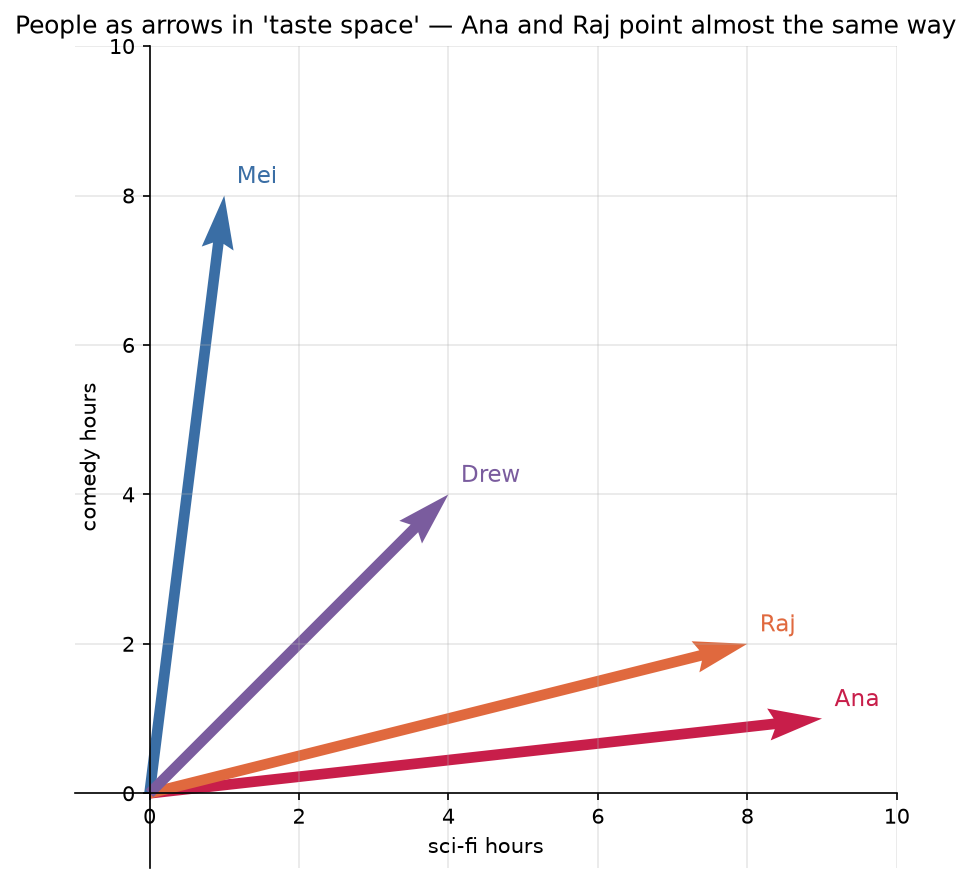
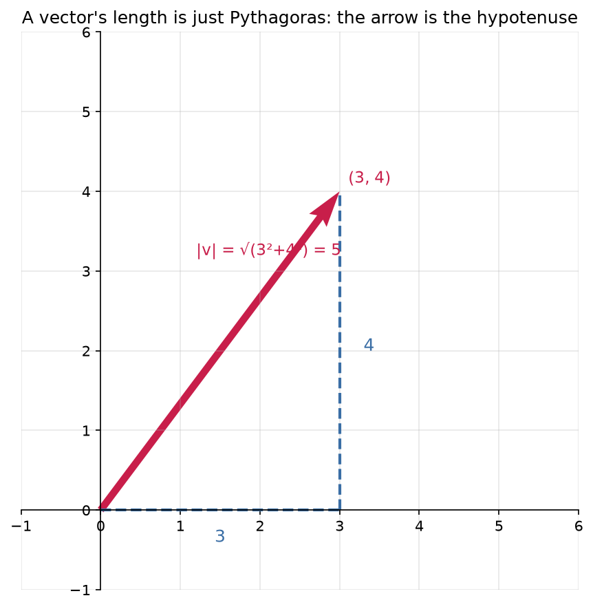

# 2.1 — Vectors: Arrows AND Lists of Numbers

*≤5 min read. Then straight to the worksheet.*

## Why this matters (the real reason)

When an LLM reads the word "cat", the first thing it does is turn it into a **list of numbers**
(an *embedding*). Every word, image, song and user-profile inside a modern AI is a vector.
The entire rest of this course — attention, gradients, neural nets — is *operations on vectors*.
Learn this one object well and modern AI stops being magic.

## The one big idea

A vector is **one thing seen two ways**:

| View | What it is | When to use it |
|---|---|---|
| **List of numbers** $(3, 4)$ | Just data in order | Storing, computing — this is what the machine sees |
| **Arrow** from the origin to the point $(3,4)$ | A direction + a length | Intuition — "are these two things similar? do they point the same way?" |

Same object. You'll flip between views constantly: **compute with the list, think with the arrow.**

$$\vec{v} = \begin{pmatrix} 3 \\ 4 \end{pmatrix}$$

And here's the move that makes it ML: *any* row of data is a vector.
A house = (bedrooms, bathrooms, land in m²) = $\begin{pmatrix} 3 \\ 2 \\ 650 \end{pmatrix}$ — an arrow in 3-D "house space".
A word embedding is the same thing with 768 numbers. You can't draw 768-D, but the arrow intuition still works — that's the whole trick.



*Four people as arrows, where the axes are "hours of sci-fi" and "hours of comedy". Ana and Raj
**point almost the same way** — similar taste. Mei points off toward comedy; Drew splits the
difference. This is exactly how a recommender or an LLM stores meaning: as directions in space.
Lesson 2.3 turns "point almost the same way" into a single number.*

## Worked example — how long is an arrow?

Find the length (the **magnitude**, written $|\vec{v}|$) of $\vec{v} = \begin{pmatrix} 3 \\ 4 \end{pmatrix}$:

1. **Square each component:** $3^2 = 9$, $\;4^2 = 16$
2. **Add them:** $9 + 16 = 25$
3. **Square-root the total:** $\sqrt{25} = 5$

$$|\vec{v}| = \sqrt{3^2 + 4^2} = 5$$

That's just Pythagoras — the arrow is the hypotenuse of a 3-across, 4-up triangle.
Works in any number of dimensions: square everything, add, root.



*The "length" of a vector is nothing new — it's the hypotenuse of the right triangle its components
make. Square the legs, add, square-root: Pythagoras, which is why $\lvert\vec v\rvert$ works
identically in 2-D, 3-D, or the 768-D of a word embedding.*

## The Python connection

```python
import numpy as np

v = np.array([3, 4])     # a numpy array IS a vector
print(v[0])              # 3  — indexing starts at 0, so v[0] is the FIRST component
print(v.shape)           # (2,) — "this vector has 2 components"
print(np.linalg.norm(v)) # 5.0 — magnitude, computed exactly like the steps above
```

New syntax: `v[0]` grabs one component by position (position 0 = first).
`.shape` asks an array how big it is — you will use it *constantly* in ML debugging.

## The classic traps

- **Python counts from 0, math counts from 1.** The math symbol $v_1$ is Python's `v[0]`.
- `[3, 4]` (a Python list) is **not** `np.array([3, 4])`. Try `[3,4] + [1,1]` — lists glue together
  (`[3, 4, 1, 1]`), they don't do math. Arrays do math.
- A vector isn't "a point". It's the *arrow from the origin to* the point — direction and length,
  not a location. This distinction earns its keep next lesson.

> **Deep-end question to hold in your head during the worksheet:**
> two houses as vectors: $(3, 2, 650)$ and $(4, 2, 700)$ feel "close". A mansion $(9, 7, 4000)$
> points somewhere else entirely. Could "how similar is the *direction* of two arrows" be a
> useful definition of *similar things*? (Lesson 2.3 says yes — and so does ChatGPT.)

**Now: worksheet `01-vectors` — pen and paper. Photograph it into `scans/inbox/` when done.**
