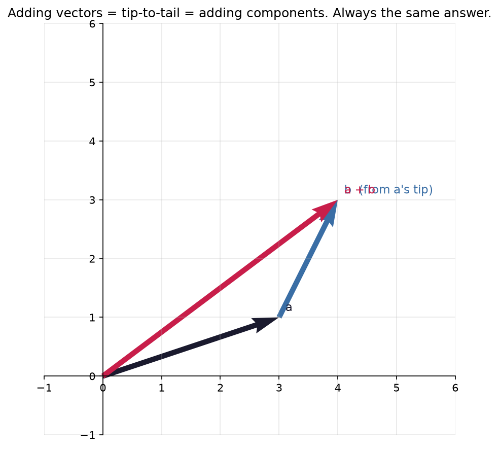
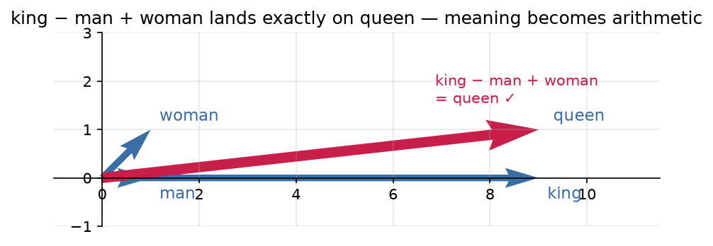

# 2.2 — Vector Arithmetic: Adding Arrows, Scaling Arrows

*≤5 min read. Then straight to the worksheet.*

## Why this matters (the real reason)

In 2013 researchers took word embeddings and computed
$\vec{king} - \vec{man} + \vec{woman}$. The answer landed almost exactly on $\vec{queen}$.
Nobody programmed that — **meaning had become arithmetic.** The only operations involved are
the two in this lesson: adding vectors and scaling them. That's it. Today's lesson is literally
the algebra of meaning.

## The one big idea

Both views from 2.1 come with their own picture of addition — and they always agree:

| Operation | List view (compute) | Arrow view (think) |
|---|---|---|
| **Add** $\vec{a} + \vec{b}$ | Add matching components | Walk along $\vec{a}$, then along $\vec{b}$ from its tip — **tip-to-tail** |
| **Subtract** $\vec{a} - \vec{b}$ | Subtract matching components | The arrow *from* $\vec{b}$'s tip *to* $\vec{a}$'s tip |
| **Scale** $2\vec{a}$ | Multiply every component by 2 | Same direction, twice as long |

$$\begin{pmatrix} 2 \\ 1 \end{pmatrix} + \begin{pmatrix} 1 \\ 3 \end{pmatrix} = \begin{pmatrix} 3 \\ 4 \end{pmatrix}
\qquad
3\begin{pmatrix} 2 \\ 1 \end{pmatrix} = \begin{pmatrix} 6 \\ 3 \end{pmatrix}$$

The number 3 in $3\vec{a}$ is called a **scalar** — a plain number, so named because it *scales* arrows.
A negative scalar flips the arrow: $-\vec{a}$ points the opposite way.



*Why the two views always agree: lay $\vec b$'s tail at $\vec a$'s tip and walk. Where you end up is
$\vec a+\vec b$ — and its components are exactly the pairwise sums. "Add the numbers" and "walk the
arrows tip-to-tail" are the same act, which is why you can compute with the list and trust the picture.*

## Worked example — king − man + woman

Pretend embeddings are 2-D: component 1 = "royalty", component 2 = "gender (0 = male, 1 = female)".

$$\vec{king} = \begin{pmatrix} 9 \\ 0 \end{pmatrix} \quad
\vec{man} = \begin{pmatrix} 1 \\ 0 \end{pmatrix} \quad
\vec{woman} = \begin{pmatrix} 1 \\ 1 \end{pmatrix}$$

Compute $\vec{king} - \vec{man} + \vec{woman}$:

1. **Subtract man from king** (component-wise): $\begin{pmatrix} 9-1 \\ 0-0 \end{pmatrix} = \begin{pmatrix} 8 \\ 0 \end{pmatrix}$
   — read it: "royalty with the man-ness removed". Pure royalty, no gender.
2. **Add woman:** $\begin{pmatrix} 8+1 \\ 0+1 \end{pmatrix} = \begin{pmatrix} 9 \\ 1 \end{pmatrix}$
   — high royalty, female.
3. **Name the result:** high-royalty + female $\approx \vec{queen}$. ∎

Real embeddings do this in 768 dimensions, but the *moves* are identical. Subtracting vectors
isolates a **difference in meaning**; adding applies it somewhere else.



*The famous result, drawn. Subtracting $\vec{man}$ strips the "man-ness" off $\vec{king}$; adding
$\vec{woman}$ paints "woman-ness" back on — and the result arrow lands **exactly on $\vec{queen}$**.
No rule for gender was ever written; it fell out of the geometry. This is the two operations from
today's lesson, running the algebra of meaning.*

## The Python connection

```python
import numpy as np

king  = np.array([9, 0])
man   = np.array([1, 0])
woman = np.array([1, 1])

print(king - man + woman)   # [9 1] — numpy does component-wise math automatically
print(3 * king)             # [27  0] — a scalar multiplies every component
```

No loops needed: numpy applies `+`, `-`, `*` to **every component at once**.
(This is called *vectorised* code, and it's why numpy is fast.)

## The classic traps

- **Mismatched lengths.** $(3, 4) + (1, 2, 5)$ is meaningless — no matching components.
  numpy will throw an error (or worse, silently "broadcast" — later module).
- **Scalar × vector vs vector × vector.** $3\vec{a}$ is defined today. $\vec{a}\vec{b}$ is *not*
  ordinary multiplication — that's next lesson, and it's not what you'd guess.
- Subtraction order matters: $\vec{a} - \vec{b}$ points **toward $\vec{a}$**. Flip the order, flip the arrow.

> **Deep-end question to hold in your head during the worksheet:**
> $\vec{paris} - \vec{france} + \vec{japan} \approx$ ? What did the subtraction isolate?
> Invent one more analogy of your own and write it as vector arithmetic.

**Now: worksheet `02-vector-arithmetic` — pen and paper. Photograph it into `scans/inbox/` when done.**
