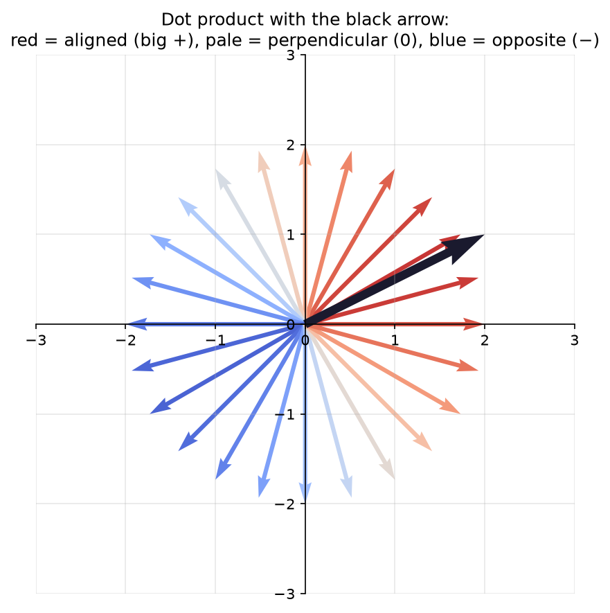
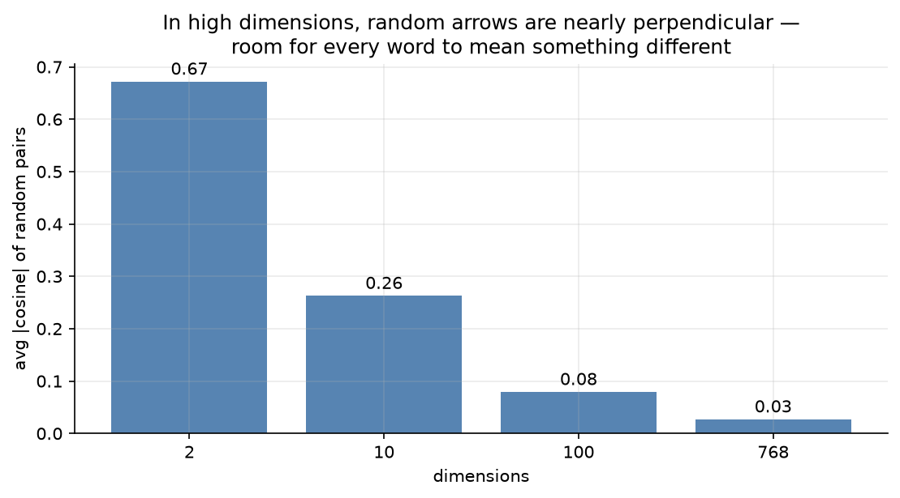

# 2.3 — The Dot Product: Similarity as a Number

*≤5 min read. Then straight to the worksheet.*

## Why this matters (the real reason)

Inside a transformer (GPT, Claude, all of them), every word asks every other word:
*"how relevant are you to me?"* That question is answered by **one dot product** per pair.
Attention — the mechanism the whole modern AI boom is built on — is dot products, at scale.
This is the single most important operation in this course. It's also small enough to master today.

## The one big idea

The dot product takes **two vectors** and returns **one plain number** measuring how much they
point the same way.

**How to compute it** (the list view): multiply matching components, then add everything up.

$$\vec{a} \cdot \vec{b} = a_1 b_1 + a_2 b_2 + \dots$$

**What it means** (the arrow view) — this is the part to memorise:

| The arrows are… | Dot product is… | Read it as… |
|---|---|---|
| Pointing the same way | **Big positive** | "very similar" |
| At right angles (perpendicular) | **Zero** | "unrelated" |
| Pointing opposite ways | **Negative** | "opposites" |

(For the curious: the exact formula is $\vec{a}\cdot\vec{b} = |\vec{a}||\vec{b}|\cos\theta$, where
$\theta$ is the angle between them. You don't need the trig — the table above *is* the intuition.)



*One black arrow, and 24 others coloured by their dot product with it. The pattern is the whole
lesson: **red** (big positive) where they align, fading to **pale** at right angles (zero), to
**blue** (negative) pointing opposite. The dot product is a similarity dial — and it found the
geometry using nothing but multiply-and-add.*

## Worked example

Compute $\begin{pmatrix} 2 \\ 3 \end{pmatrix} \cdot \begin{pmatrix} 4 \\ 1 \end{pmatrix}$:

1. **Multiply matching components:** $2 \times 4 = 8$ and $3 \times 1 = 3$
2. **Add the products:** $8 + 3 = 11$
3. **Interpret the sign and size:** positive and decent-sized → these arrows lean the same way.

Now a perpendicular pair — watch it vanish:

$$\begin{pmatrix} 2 \\ 3 \end{pmatrix} \cdot \begin{pmatrix} -3 \\ 2 \end{pmatrix} = (2)(-3) + (3)(2) = -6 + 6 = 0$$

Zero. Right angle. "Nothing in common." The dot product *detected geometry* using only arithmetic.

## One honest wrinkle: length cheats

A long vector scores big dots just by being long. To compare pure *direction*, divide out the lengths:

$$\text{cosine similarity} = \frac{\vec{a} \cdot \vec{b}}{|\vec{a}||\vec{b}|}
\qquad \text{always between } -1 \text{ and } 1$$

$1$ = same direction, $0$ = unrelated, $-1$ = opposite. This exact number powers semantic search:
"find me documents whose embedding has cosine similarity ≈ 1 with my question."

## The Python connection

```python
import numpy as np

a = np.array([2, 3])
b = np.array([4, 1])

print(a * b)          # [8 3]  — element-wise multiply: still a VECTOR. Not the dot product!
print(np.sum(a * b))  # 11    — multiply then sum: THE dot product, by hand
print(a @ b)          # 11    — the @ operator: numpy's built-in dot product
```

New syntax: `@` is Python's "vector/matrix product" operator. `a * b` and `a @ b` are
**different operations** — the classic numpy beginner trap, and now you're immune.

## The classic traps

- **Dot product returns ONE number**, not a vector. If your "dot product" has brackets around it,
  you did `*` (element-wise) and forgot the sum.
- **Big dot ≠ similar direction** if lengths differ wildly — use cosine similarity to compare fairly.
- Zero doesn't mean "zero vectors" — it means **perpendicular**. Nonzero arrows can dot to 0.



*The deep-end question, answered by experiment. Pick two arrows at random and measure how aligned
they are, on average. In 2-D they collide constantly (≈0.6); by 768-D they're **almost always nearly
perpendicular** (≈0.03). High-dimensional space is roomy — enough for tens of thousands of words to
each get their own near-independent direction. That "blessing of dimensionality" is *why* embeddings
work at all.*

> **Deep-end question to hold in your head during the worksheet:**
> in 2-D, only 1 direction is perpendicular to a given arrow. In 768-D, there's *enormous* room —
> almost every random pair of arrows is nearly perpendicular. Why is that convenient
> if you want thousands of words to each mean something *different*? (The plot above is the answer.)

**Now: worksheet `03-dot-product-similarity` — pen and paper. Photograph it into `scans/inbox/` when done.**
