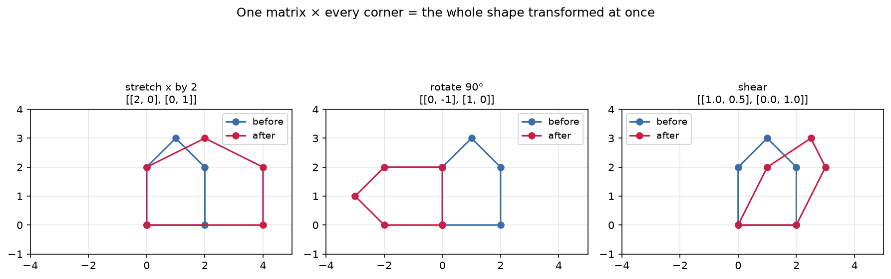
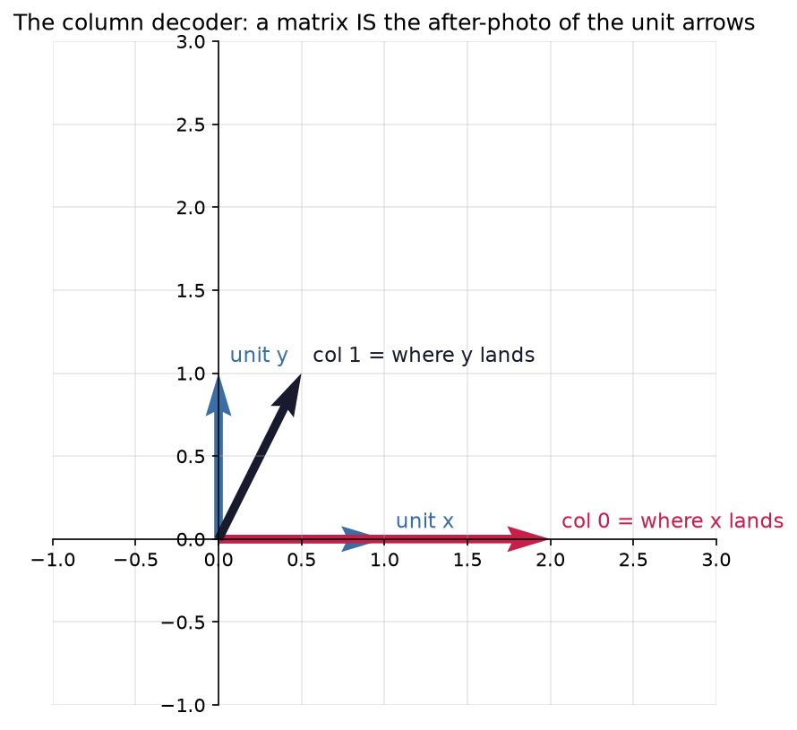

# 2.4 — Matrices: Data Tables AND Transformation Machines

*≤5 min read. Then straight to the worksheet.*

## Why this matters (the real reason)

The "learning" in deep learning lives in **weight matrices**. A neural network layer is a matrix;
training *is* nudging its numbers. And your training data? Also a matrix. Two meanings, one object —
exactly like the vector's two views in 2.1, scaled up. Read both fluently and you can read
the architecture diagrams of real networks.

## The one big idea

A **matrix** is a rectangular grid of numbers. Its **shape** is (rows × columns), always rows first.

$$M = \begin{pmatrix} 3 & 2 & 650 \\ 4 & 2 & 700 \\ 9 & 7 & 4000 \end{pmatrix} \quad \text{shape } 3 \times 3$$

**View 1 — a data table.** Each **row is a sample**, each **column is a feature**.
Above: 3 houses (rows) × 3 features (beds, baths, land). A "batch" of data in ML is exactly this —
a stack of data vectors, one per row.

**View 2 — a machine that transforms vectors.** A matrix eats a vector, outputs a new vector.
Feed the same matrix every point of a shape and it rotates, stretches, or skews the whole shape at once.
Function-machine from Module 1.1 — but the input and output are vectors.



*The same house, fed to three different matrix-machines. One matrix stretches it, one rotates it, one
shears it — and each does so to **every corner at once** with a single multiplication. A matrix isn't
just a table of numbers; it's a machine that reshapes space.*

## Worked example — feeding a vector to a matrix

Compute $\begin{pmatrix} 2 & 0 \\ 0 & 3 \end{pmatrix}\begin{pmatrix} 4 \\ 5 \end{pmatrix}$:

1. **Take row 1, dot it with the vector:** $(2)(4) + (0)(5) = 8$ — that's output component 1.
2. **Take row 2, dot it with the vector:** $(0)(4) + (3)(5) = 15$ — output component 2.
3. **Stack the results:** $\begin{pmatrix} 8 \\ 15 \end{pmatrix}$

$$\begin{pmatrix} 2 & 0 \\ 0 & 3 \end{pmatrix}\begin{pmatrix} 4 \\ 5 \end{pmatrix} = \begin{pmatrix} 8 \\ 15 \end{pmatrix}$$

**Each output component is one dot product** — row of the matrix · input vector.
Lesson 2.3 wasn't a detour; it's the engine inside every matrix operation.

Notice what this machine *did*: doubled the x, tripled the y. It's a stretch machine.

## The secret decoder: read the columns

Where does a matrix send the two unit arrows $\begin{pmatrix}1\\0\end{pmatrix}$ and $\begin{pmatrix}0\\1\end{pmatrix}$?
Run the worked-example steps and you'll find: **column 1 of the matrix is where $\begin{pmatrix}1\\0\end{pmatrix}$ lands,
column 2 is where $\begin{pmatrix}0\\1\end{pmatrix}$ lands.** A matrix *is* the after-photo of the unit arrows.
Want a machine that swaps x and y? Write down where the unit arrows should go: $\begin{pmatrix} 0 & 1 \\ 1 & 0 \end{pmatrix}$. Done.



*The decoder, drawn. Feed the matrix the unit-x arrow and it lands on **column 0**; feed it unit-y and
it lands on **column 1**. So to build any machine you want, just decide where the two unit arrows
should go and write those as the columns. Reading a matrix = reading where the axes end up.*

## The Python connection

```python
import numpy as np

M = np.array([[2, 0],      # a matrix = a list of rows
              [0, 3]])
v = np.array([4, 5])

print(M.shape)   # (2, 2) — (rows, columns), rows FIRST
print(M @ v)     # [ 8 15] — @ again: matrix times vector
print(M[0])      # [2 0]   — row 0
print(M[:, 0])   # [2 0]   — column 0. The `:` means "every row"; then column 0.
```

New syntax: `M[:, 0]` — read it as "all rows, column 0". Slicing like this is daily numpy life.

## The classic traps

- **Rows first, always.** Shape $(3, 2)$ = 3 rows, 2 columns. Saying it backwards breaks everything downstream.
- `M * v` is element-wise (with surprising broadcasting rules) — **not** the matrix product. Use `@`.
- Row vector vs column vector: in these lessons vectors stand upright (columns) so machines eat them from the left: $M\vec{v}$.

> **Deep-end question to hold in your head during the worksheet:**
> using the column decoder — what matrix leaves *every* vector exactly where it was?
> (What must happen to the unit arrows?) That matrix has a famous name.

**Now: worksheet `04-matrices` — pen and paper. Photograph it into `scans/inbox/` when done.**
