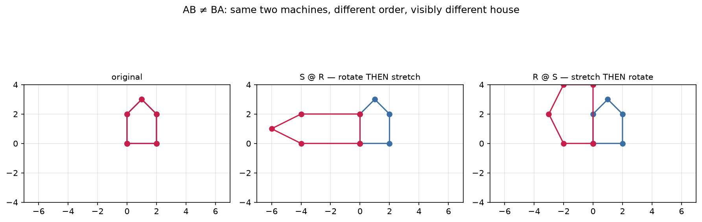

# 2.5 — Matrix Multiplication: Why the Weird Rule

*≤5 min read. Then straight to the worksheet.*

## Why this matters (the real reason)

"Deep" in deep learning means **layers feeding layers** — machines composed with machines,
exactly Module 1.4. Each layer is a matrix (2.4). So the question "what single machine equals
*layer B then layer A*?" needs an answer, and that answer is matrix multiplication.
The row×column rule isn't arbitrary — it's **composition of transformations**, written as arithmetic.
GPUs spend most of their lives doing exactly this.

## The one big idea

$AB$ means: **the single machine that does B first, then A.** (Right-to-left, like $f(g(x))$ —
the vector enters from the right: $AB\vec{v} = A(B\vec{v})$.)

To find each entry of the product: **row of A, dot column of B.**

$$ (AB)_{\text{row } i,\ \text{col } j} = (\text{row } i \text{ of } A) \cdot (\text{col } j \text{ of } B) $$

Why is that composition? Column $j$ of $B$ is where machine $B$ sends unit arrow $j$ (the 2.4 decoder).
Feeding that output into $A$ = dotting it with $A$'s rows. So column $j$ of $AB$ is
"where the combined machine sends unit arrow $j$" — which is exactly what a matrix's columns must be.

**The shape rule.** An $(m \times n)$ times an $(n \times p)$ gives $(m \times p)$:

$$ (m \times \underbrace{n)(n}_{\text{must match, then cancel}} \times p) = (m \times p) $$

Inner numbers must match (rows of A need exactly as many entries as columns of B are tall).
Check shapes *before* computing — it catches half of all real ML bugs.

## Worked example

Compute $AB$ where $A = \begin{pmatrix} 1 & 2 \\ 3 & 4 \end{pmatrix}$, $B = \begin{pmatrix} 5 & 6 \\ 7 & 8 \end{pmatrix}$:

1. **Shape-check:** $(2\times2)(2\times2)$ — inner 2s match → result is $2\times2$. Safe to proceed.
2. **Top-left = row 1 · col 1:** $(1)(5) + (2)(7) = 19$
3. **Top-right = row 1 · col 2:** $(1)(6) + (2)(8) = 22$
4. **Bottom-left = row 2 · col 1:** $(3)(5) + (4)(7) = 43$
5. **Bottom-right = row 2 · col 2:** $(3)(6) + (4)(8) = 50$

$$AB = \begin{pmatrix} 19 & 22 \\ 43 & 50 \end{pmatrix}$$

Finger technique: left hand slides across A's row, right hand slides down B's column,
multiply as you go, add at the end. One dot product per entry.

## The Python connection

```python
import numpy as np

A = np.array([[1, 2], [3, 4]])
B = np.array([[5, 6], [7, 8]])

print(A @ B)             # [[19 22] [43 50]] — the real matrix product
print(np.matmul(A, B))   # same thing, spelled out
print(A * B)             # [[ 5 12] [21 32]] — element-wise. NOT the same. Classic bug.
print(A @ B == B @ A)    # mostly False — order matters!
```

## The classic traps

- **$AB \neq BA$.** "Rotate then stretch" is a different machine from "stretch then rotate".
  Matrix multiplication is the first multiplication you've met where order changes the answer.



*Proof that order matters, in one glance. **Rotate then stretch** and **stretch then rotate** are the
same two machines composed in opposite orders — and they land the house in genuinely different places.
That's $AB \neq BA$. Composition, from Module 1.4, remembers who went first.*
- **`*` vs `@`** — element-wise vs true product. If your network is mysteriously broken, check this first.
- **Shape mismatch:** $(2\times3)(2\times3)$ is illegal — inner numbers 3 and 2 don't match.
  numpy's error message will say exactly this; now you can read it.

> **Deep-end question to hold in your head during the worksheet:**
> a 3-layer network is $C(B(A\vec{v}))$ — three matmuls per input. Someone computes $M = CBA$ once,
> then just does $M\vec{v}$ per input. Same answer? Why might a phone running a neural net care?

**Now: worksheet `05-matrix-multiplication` — pen and paper. Photograph it into `scans/inbox/` when done.**
