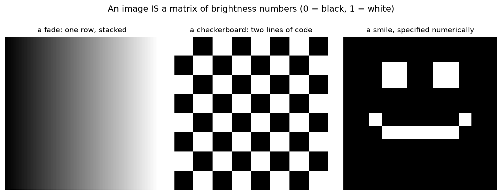
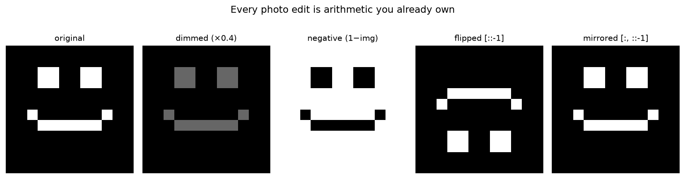
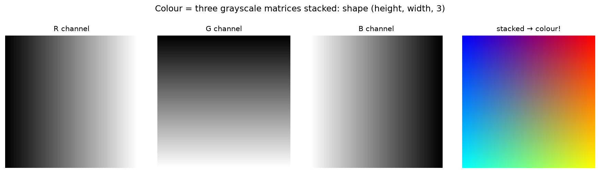

# 2.6 — Images ARE Matrices

*≤5 min read. Then straight to the worksheet — and the best notebook so far.*

## Why this matters (the real reason)

This is your first genuine computer vision. A digital image isn't *like* a matrix — it **is** one:
a grid of brightness numbers. Which means everything from this module applies to photos directly.
Instagram filters, face detection, stable diffusion: matrix operations on pixel grids.
When Module 5 slides dot products across images to detect edges (that's a *convolution*),
today is the lesson it stands on.

## The one big idea

A grayscale image is a matrix where each entry is one **pixel's brightness**: 0 = black, 1 = white.

$$\text{a tiny 4×4 image:} \quad
\begin{pmatrix}
0 & 0 & 0 & 0 \\
0 & 1 & 1 & 0 \\
0 & 1 & 1 & 0 \\
0 & 0 & 0 & 0
\end{pmatrix}
\;=\; \text{a white square on black}$$



*Three images that are nothing but numbers in a grid. The fade is one row of rising values stacked;
the checkerboard is two lines of slicing; the smiley is a dozen pixels set to 1. Squint and you see a
picture; look closely and it's a matrix — literally the same object.*

And the operations you already own become photo edits:

| Math you know | On an image it means |
|---|---|
| Scalar multiply (2.2) | Brightness up/down |
| Slicing rows/columns (2.4) | Crop |
| Reversing row order | Flip upside-down |
| $1 - $ every entry | Invert (photo negative) |



*Every one of these is arithmetic you already own. Dim = multiply by 0.4. Negative = $1-\text{img}$.
Flip = reverse the rows (`[::-1]`). Mirror = reverse the columns. An Instagram filter is just a matrix
operation with a marketing budget.*

Colour is one more stacking trick: an **RGB image is three grayscale matrices** — a red one, a
green one, a blue one — stored together with shape `(height, width, 3)`.



*Colour is just three of these matrices stacked — how much red, green and blue at each pixel. Three
grayscale grids in, one colour image out, shape `(height, width, 3)`. Every photo on your phone is
this: three matrices in a trench coat.*

## Worked example — brighten a dark image

Brighten $\begin{pmatrix} 0.1 & 0.2 \\ 0.3 & 0.4 \end{pmatrix}$ by 3×:

1. **Scale every pixel:** multiply the whole matrix by the scalar 3 →
   $\begin{pmatrix} 0.3 & 0.6 \\ 0.9 & 1.2 \end{pmatrix}$
2. **Check the legal range:** 1.2 > 1 — brighter-than-white doesn't exist.
3. **Clip back into range:** anything over 1 becomes 1 →
   $\begin{pmatrix} 0.3 & 0.6 \\ 0.9 & 1.0 \end{pmatrix}$

That clip step is real: blown-out highlights in an overexposed photo are exactly pixels
that hit the ceiling and lost their detail.

## The Python connection

```python
import numpy as np

img = np.zeros((4, 4))        # np.zeros(shape) → a matrix full of 0s: a black image
img[1:3, 1:3] = 1.0           # rows 1–2, cols 1–2 → white. Slice ranges: 1:3 means 1 and 2

brighter = np.clip(img * 1.5, 0, 1)   # scale, then clip into [0, 1]
crop     = img[0:2, 0:2]              # top-left 2×2 corner — cropping IS slicing
flipped  = img[::-1]                  # ::-1 reverses the rows → vertical flip
negative = 1 - img                    # photo negative in three characters
```

New syntax: `img[1:3, 1:3]` selects a rectangle (row range, column range) —
and *assigning* to it paints that rectangle. `::-1` is "the same thing, backwards".

## The classic traps

- **`img[row, col]` = `img[y, x]`** — vertical coordinate first, because rows come first.
  Every beginner writes `img[x, y]` once and gets a transposed mess. Now you won't.
- **Row 0 is the TOP.** Matrix row order runs downward, so images have their origin top-left,
  not bottom-left like graphs.
- Values escaping $[0, 1]$ after arithmetic — always ask whether you need to clip.

> **Deep-end question to hold in your head during the worksheet:**
> a 3×3 patch of image dotted with the 9-number "pattern" $\begin{pmatrix} -1&-1&-1\\ 0&0&0\\ 1&1&1 \end{pmatrix}$
> (flattened, then dot product) gives ≈ 0 on flat sky but a big number on a horizon. Why?
> What is that dot product *detecting*? (2.3: dot = similarity… similarity to what?)

**Now: worksheet `06-images-are-matrices`, then the notebook — you're going to paint with algebra.**
