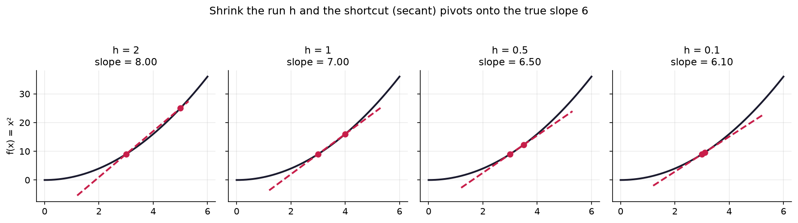
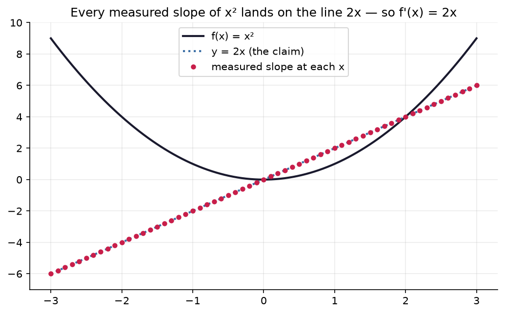
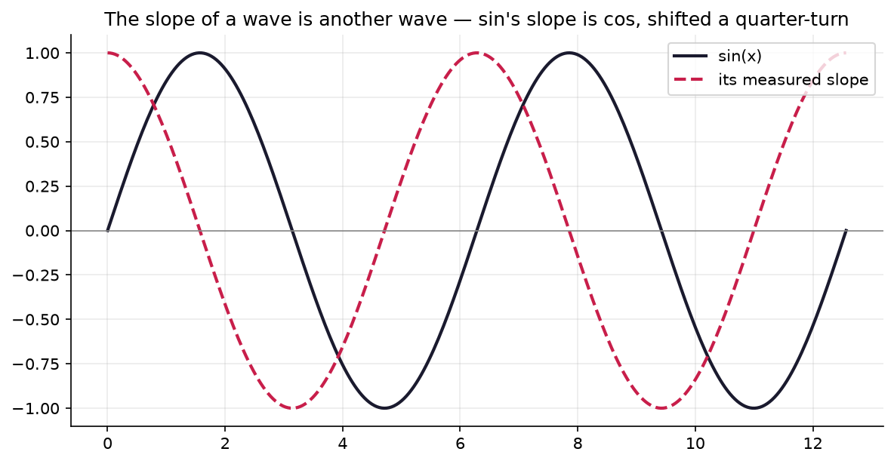

# 3.1 — Slope Everywhere: the Derivative

*≤5 min read. Then straight to the worksheet.*

## Why this matters (the real reason)

Training a neural network is one question asked billions of times:
**"if I nudge this weight a tiny bit, how much does the loss change?"**
That number — how sensitive the output is to a nudge in the input — is called the **derivative**.
It's the single most important number in deep learning, and you can compute it *right now* with
Year 10 arithmetic and a small $h$. No mystery symbols required.

## The one big idea

You already know slope for a line: **rise over run**.

$$\text{slope} = \frac{\text{rise}}{\text{run}} = \frac{f(x+h) - f(x)}{h}$$

For a line, you get the same answer everywhere — a line has *one* slope.
A **curve** doesn't. $f(x) = x^2$ is nearly flat at $x = 0$ and steep at $x = 3$.
So the question changes from "what's THE slope?" to **"what's the slope right HERE?"**

The trick: zoom in. Take a tiny run $h$, measure the rise, divide. The smaller $h$ gets,
the closer your answer gets to the true slope *at that point*. That true slope is the derivative,
written $f'(x)$:



*Watch it happen: the dashed red line is the "shortcut" between two points on the curve — the slope
your formula actually measures. With a big run ($h=2$) the shortcut cuts across the bend and
overshoots (slope 8). Shrink $h$ and the far point slides back toward $x=3$, the shortcut pivots,
and the slope closes in on the true value **6**. The derivative is where this pivoting settles.*

$$f'(x) \approx \frac{f(x+h) - f(x)}{h} \quad \text{for tiny } h$$

Read it as **sensitivity**: nudge the input by $h$, and the output moves by about $f'(x) \times h$.

*(Mathematicians make $h$ shrink all the way to zero and call the result a "limit".
We'll meet that idea properly one day — for now, tiny $h$ and a calculator get you everything.)*

## Watch one get computed

Slope of $f(x) = x^2$ at $x = 3$, using $h = 0.001$:

$$\frac{f(3.001) - f(3)}{0.001} \qquad \leftarrow \text{move: substitute into the slope formula}$$
$$= \frac{9.006001 - 9}{0.001} \qquad \leftarrow \text{move: evaluate } 3.001^2 \text{ and } 3^2$$
$$= \frac{0.006001}{0.001} = 6.001 \qquad \leftarrow \text{move: subtract, then divide by } h$$

The true answer is exactly $6$ — our tiny-$h$ estimate landed within a whisker.
Try $x = 1$ and you'll get $\approx 2$. Try $x = 5$: $\approx 10$. See the pattern forming?



*Here's the pattern made visible. Measure the slope of $x^2$ at 61 different $x$-values (red dots)
and they don't scatter — they trace a perfectly straight line, $y = 2x$. The slope of a curve is
itself a **function**. That's the deep-end question below, already answered by the picture: the
derivative of $x^2$ is $2x$. You'll regenerate this exact plot in the notebook and can swap $x^2$
for any function you like.*

## The Python connection

The slope formula is four lines of Python, and it works on **any** function:

```python
def derivative(f, x, h=1e-6):        # 1e-6 means 0.000001 — a tiny nudge
    rise = f(x + h) - f(x)
    return rise / h

def f(x):
    return x**2

print(derivative(f, 3))   # ≈ 6.000001
```

This is not a toy. Numerical "nudge and measure" is exactly how you *sanity-check* every
derivative you'll ever compute by hand — and how we'll check every rule in the next lesson.

## What breaks it (the classic traps)

- **$h$ too big** — with $h = 1$ you get the slope of a long shortcut across the curve, not the
  slope at the point. (With $h=1$ at $x=3$: answer 7, not 6.)
- **$h = 0$** — that's $\frac{0}{0}$, division by zero. The whole game is *tiny but not zero*.
- **Confusing height with slope.** $f(3) = 9$ is where the curve *is*; $f'(3) = 6$ is how fast
  it's *climbing*. Different questions, different numbers.

And it works on *any* function, not just parabolas. Measure the slope of a **wave** everywhere:



*The slope of a wave is another wave — the same shape, slid a quarter-turn left. Sine's slope is
cosine. You don't need to know that yet; the point is that "nudge and measure" turns any curve into
its slope-curve, no special rules required. That's the engine under everything to come.*

> **Deep-end question to hold in your head during the worksheet:**
> at $x = 1, 2, 3, 5$ the slope of $x^2$ came out $\approx 2, 4, 6, 10$.
> The derivative of $x^2$ seems to be… a *function*: $2x$. Can you use the balance-game algebra
> on $\frac{(x+h)^2 - x^2}{h}$ to prove it?

**Now: worksheet `01-slope-and-derivative` — pen and paper. Photograph it into `scans/inbox/` when done.**
