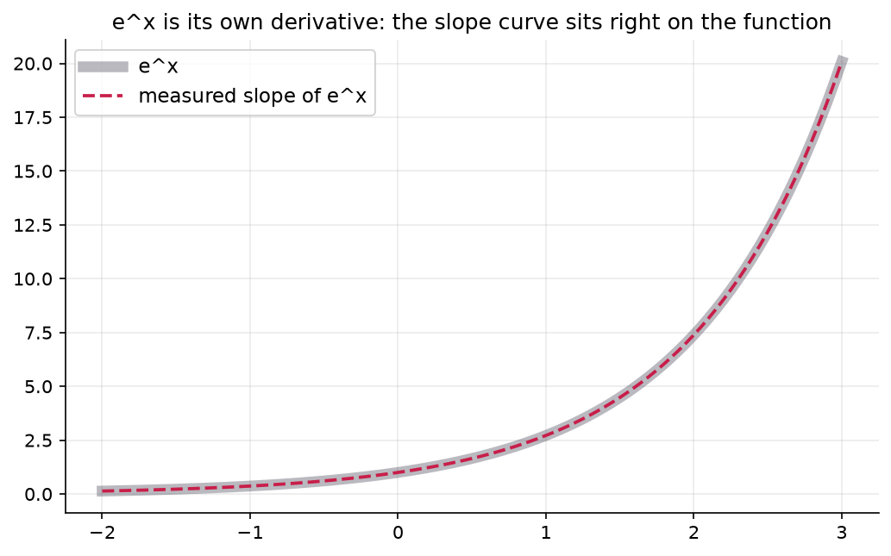

# 3.2 — Derivative Rules for the Shape Zoo

*≤5 min read. Then straight to the worksheet.*

## Why this matters (the real reason)

ML papers differentiate mid-sentence, without pausing: "*the gradient of $w^2$ is $2w$, so…*"
If you have to stop and nudge-with-tiny-$h$ every time, you can't follow the story.
You need a handful of rules at your fingertips — the same way you know $7 \times 8$ without
counting. Five rules cover almost every function the shape zoo (Module 1) taught you,
and they're all *discoverable*, not decreed.

## The one big idea

Each rule is just the tiny-$h$ computation from 3.1, done once in general, so you never
have to do it again.

| Function | Derivative | Why (the intuition) |
|---|---|---|
| $c$ (constant) | $0$ | A flat line doesn't rise. Nudge in, nothing out. |
| $x^n$ | $n\,x^{n-1}$ | **Power rule.** Expand $(x+h)^n$: you get $x^n$ plus $n$ copies of $x^{n-1}h$, plus crumbs with $h^2$ that vanish for tiny $h$. |
| $c \cdot f(x)$ | $c \cdot f'(x)$ | Stretching a graph 3× taller makes every slope 3× steeper. |
| $f(x) + g(x)$ | $f'(x) + g'(x)$ | Two nudges to the output just add up. Differentiate term by term. |
| $e^x$ | $e^x$ | The celebrity. Its growth *rate* equals its current *value* — like interest that compounds continuously: the more money, the faster it grows. |
| $\ln x$ | $\dfrac{1}{x}$ | $\ln$ undoes $e^x$, so its slope is the mirror-flip: $e^x$ climbs faster and faster, so $\ln x$ flattens as $\frac{1}{x}$. |

Trust but verify: every one of these can be checked with your `derivative()` function from 3.1.
In the notebook, we make `sympy` the referee.



*The strangest rule, made obvious. For every other function the slope curve is a **different**
shape from the function. For $e^x$ it's the same shape: measure the slope of $e^x$ everywhere
(red dashed) and it lands right on $e^x$ itself (pale band). That's what "$e^x$ is its own
derivative" looks like — the one function whose rate of growth equals its current height.*

## Watch one get played

Differentiate $f(x) = 3x^4 - 5x + 7$:

$$f'(x) = \frac{d}{dx}(3x^4) - \frac{d}{dx}(5x) + \frac{d}{dx}(7) \qquad \leftarrow \text{move: sum rule — term by term}$$
$$= 3 \cdot 4x^3 - 5 \cdot 1x^0 + 0 \qquad \leftarrow \text{move: power rule on each; constant rule on } 7$$
$$= 12x^3 - 5 \qquad \leftarrow \text{move: tidy up } (x^0 = 1)$$

Note $\frac{d}{dx}$ is just notation for "the derivative of, with respect to $x$" —
you'll see it constantly in papers, alongside the shorthand $f'$.

## The Python connection

`sympy` plays by these exact rules, symbolically — your answer checker:

```python
import sympy as sp

x = sp.symbols("x")
print(sp.diff(3*x**4 - 5*x + 7, x))   # 12*x**3 - 5  ← the referee agrees
print(sp.diff(sp.exp(x), x))          # exp(x)  — its own derivative, confirmed
print(sp.diff(sp.log(x), x))          # 1/x     (sympy's log IS ln)
```

Use it to *check* pen-and-paper work, never to skip it. The reps are the point.

## What breaks it (the classic traps)

- **Power rule on a constant:** $7$ is not $7x^0$-then-panic — its derivative is just $0$.
- **Power rule on $e^x$:** $e^x \to x e^{x-1}$ is illegal. Power rule needs *the variable in
  the base*, not in the exponent.
- **Dropping the coefficient:** $\frac{d}{dx}(3x^4) = 12x^3$, not $4x^3$. The 3 rides along.
- **$\ln$ confusion:** $\frac{d}{dx}\ln x = \frac{1}{x}$, not $\ln(1)$ or $\frac{1}{\ln x}$.

> **Deep-end question to hold in your head during the worksheet:**
> $e^x$ is its own derivative. Is it the *only* function with that property?
> What about $5e^x$? What about $e^x + 1$? One of those still works, one doesn't — why?

**Now: worksheet `02-derivative-rules` — pen and paper. Photograph it into `scans/inbox/` when done.**
