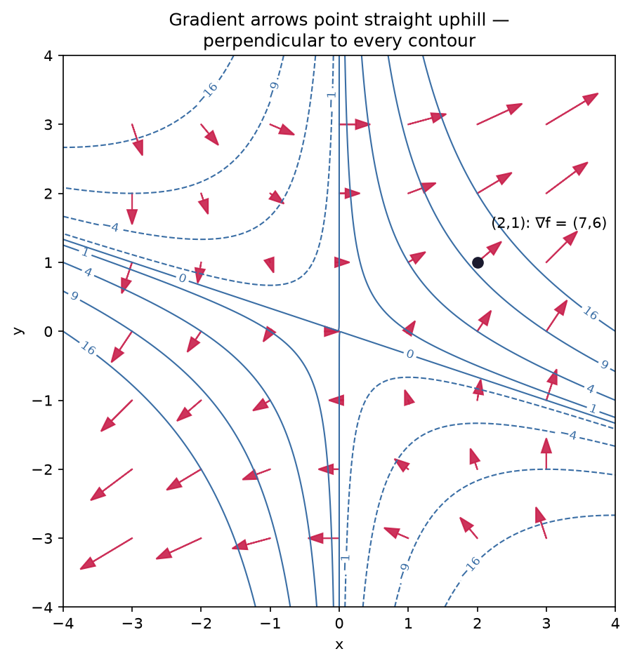
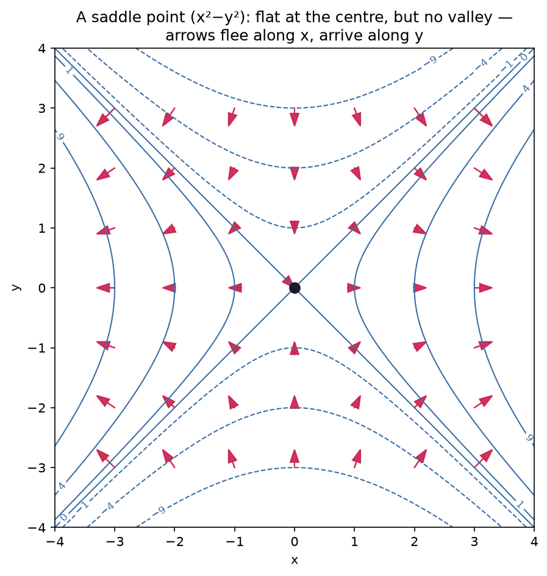

# 3.4 — Partial Derivatives & the Gradient

*≤5 min read. Then straight to the worksheet.*

## Why this matters (the real reason)

A real loss function doesn't have one input — it has **millions**: one per weight.
"Nudge the input" becomes "nudge *which* input?" The answer: nudge them one at a time.
Each one-at-a-time sensitivity is a **partial derivative**, and the full list of them, stacked
into a vector, is the **gradient** — the $\nabla$ (nabla) you see in every ML paper.
$\nabla L$ literally means "the list of every weight's sensitivity". After this lesson,
that symbol stops being decoration.

## The one big idea

For a function of several inputs, like $f(x, y) = x^2 + 3xy$:

**Partial derivative = wiggle one input, freeze the rest.**

$\dfrac{\partial f}{\partial x}$ (curly $\partial$, said "partial") means: treat $y$ as a frozen
constant — just a number that happens to be wearing a letter — and differentiate with respect to
$x$ using the ordinary rules from 3.2. Nothing new to learn, only a new attitude toward the
other letters.

Stack the partials into a vector (Module 2 pays off) and you get the gradient:

$$\nabla f = \left( \frac{\partial f}{\partial x},\; \frac{\partial f}{\partial y} \right)$$

And here's the geometric miracle: at any point, **the gradient vector points in the direction of
steepest uphill**, and its length says how steep. Picture the function as terrain and its contour
map (like a topographic hiking map): the gradient arrow at any spot points straight up the hill —
perpendicular to the contour line you're standing on.



*The blue rings are contours — lines of equal height, like on a hiking map. The red arrow at each
point is the gradient $\nabla f$. Two things to *see* and never forget: every arrow crosses its
contour at a **right angle** (that's the deep-end question, answered), and every arrow points
toward **higher** ground, longer where the hill is steeper. At $(2,1)$ the arrow is
$\nabla f = (7,6)$, exactly the numbers we compute below.*

## Watch one get played

Gradient of $f(x, y) = x^2 + 3xy$ at the point $(2, 1)$:

$$\frac{\partial f}{\partial x} = 2x + 3y \qquad \leftarrow \text{move: freeze } y \text{; power rule on } x^2 \text{; } 3xy \text{ is (constant } 3y) \times x$$
$$\frac{\partial f}{\partial y} = 0 + 3x \qquad \leftarrow \text{move: freeze } x \text{; } x^2 \text{ is now a constant} \to 0 \text{; } 3xy \text{ is } (3x) \times y$$
$$\nabla f(2, 1) = (2\cdot2 + 3\cdot1,\; 3\cdot2) = (7,\; 6) \qquad \leftarrow \text{move: substitute the point}$$

Meaning: standing at $(2,1)$, nudging $x$ moves the output 7× the nudge; nudging $y$ moves it 6×.
Steepest climb: head in direction $(7, 6)$.

## The Python connection

Numerical partials are the same nudge trick — nudge one coordinate, freeze the other:

```python
def f(x, y):
    return x**2 + 3*x*y

h = 1e-6
df_dx = (f(2 + h, 1) - f(2, 1)) / h   # nudge x only  → ≈ 7.0
df_dy = (f(2, 1 + h) - f(2, 1)) / h   # nudge y only  → ≈ 6.0
print(df_dx, df_dy)                    # the gradient, measured
```

That's the picture above, and in the notebook you'll rebuild it yourself — draw the contour map,
compute the arrows with the nudge trick, and lay them on top. Change the function and watch the
whole arrow-field reshape.

## What breaks it (the classic traps)

- **Forgetting who's frozen:** in $\frac{\partial}{\partial x}(3xy)$, the $y$ is a constant
  passenger → answer $3y$. Differentiating it too (getting $3$) is the classic slip.
- **Gradient points UPhill.** Training wants DOWNhill — that's why every update rule has a
  minus sign in front of $\nabla$. Next lesson is exactly this.
- **$\partial$ vs $d$:** same idea, different context. $d$ when there's one input,
  $\partial$ when there are several and you're wiggling just one. Papers switch freely.

### 🌀 A glimpse of the deep end: not every flat spot is a valley

Set every partial to zero and you've found a **flat** point — but flat doesn't mean *bottom*.
Look at $f(x,y) = x^2 - y^2$:



*This is a **saddle** (shaped like a Pringle, or a horse's saddle): the origin is flat — gradient
zero — yet it's a valley in one direction and a hilltop in the other. The arrows give it away: they
*flee* the centre along $x$ but *arrive* at it along $y$. High-dimensional loss surfaces are riddled
with saddles, and getting stuck near them is one of the real headaches of training big models. "Flat"
is necessary for a minimum, but not sufficient — a lesson that costs GPU-years to relearn.*

> **Deep-end question to hold in your head during the worksheet:**
> why *must* the gradient be perpendicular to the contour line? Hint: a contour is the direction
> you can walk with zero change in height. If uphill had any lean along the contour…

**Now: worksheet `04-partials-and-gradient` — pen and paper. Photograph it into `scans/inbox/` when done.**
