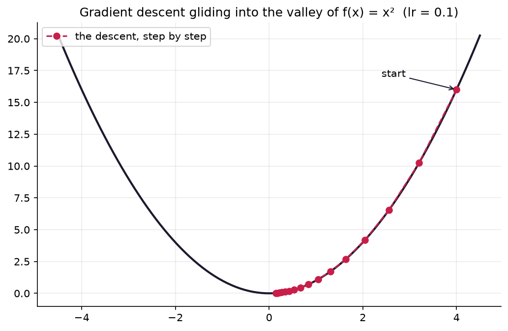
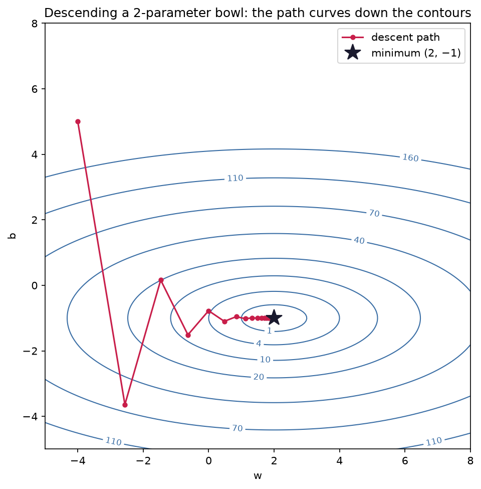
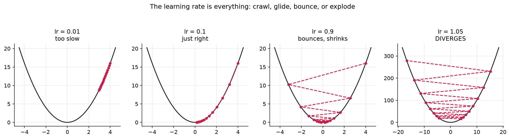

# 3.5 — Gradient Descent: Watch Your Code Learn

*≤5 min read. Then straight to the worksheet — and the notebook, where the magic happens.*

## Why this matters (the real reason)

This is the payoff the whole module has been building toward. Every neural network —
GPT, stable diffusion, the lot — is trained by the algorithm on this page. Not something
like it. **This one.** Three lines of Python. By the end of today you'll have written it
from scratch and watched it learn.

## The one big idea

You're on a foggy hillside (the loss surface) and want the valley (minimum loss).
You can't see far, but you *can* feel the slope under your feet — that's the derivative.
Strategy: take a small step **downhill**, feel again, step again. Repeat.

$$x_{\text{new}} = x - \eta \cdot f'(x)$$

- $f'(x)$: the slope where you stand (points uphill, so we subtract to go down).
- $\eta$ (eta): the **learning rate** — how big a step you take. In papers it's $\eta$ or `lr` in code.

Two beautiful built-in behaviours: steep ground → big $f'(x)$ → bold steps; near the valley floor
→ slope shrinks → steps shrink automatically. It *brakes as it arrives*.

For many inputs, same rule with the gradient: $\mathbf{w}_{\text{new}} = \mathbf{w} - \eta \nabla f(\mathbf{w})$.
That line, applied to millions of weights, is a neural network training. All of it.

## Watch one get played

Minimise $f(x) = x^2$ (derivative $f'(x) = 2x$, from 3.1), starting at $x = 4$, with $\eta = 0.1$:

$$x_1 = 4 - 0.1 \times f'(4) = 4 - 0.1 \times 8 = 3.2 \qquad \leftarrow \text{move: slope 8 uphill, step } 0.8 \text{ downhill}$$
$$x_2 = 3.2 - 0.1 \times 6.4 = 2.56 \qquad \leftarrow \text{move: smaller slope, smaller step}$$
$$x_3 = 2.56 - 0.1 \times 5.12 = 2.048 \qquad \leftarrow \text{move: same rule, every time}$$

Each value is $0.8\times$ the last — it glides toward the true minimum at $x = 0$, never
told where it is, only ever feeling the local slope.



*Every footstep, plotted. Notice the steps are **big at the top** (steep slope → bold step) and
**shrink toward the bottom** (shallow slope → tiny step). Nobody programmed that slow-down —
it falls out of "step size = slope × learning rate". The algorithm brakes as it arrives.*

## The Python connection

The entire algorithm:

```python
x = 4.0                 # start anywhere
lr = 0.1                # learning rate (that's eta)
for step in range(30):
    slope = 2 * x       # f'(x) for f(x) = x²
    x = x - lr * slope  # THE update rule
print(x)                # ≈ 0.0007 — it found the valley
```

Swap in a different `slope` line and it minimises a different function. Swap in a gradient
and it minimises a surface — same three lines, now stepping in two directions at once:



*The two-input version, which is all a real network is. The rings are the loss surface seen from
above; the red path is descent stepping in $w$ **and** $b$ at once, each step opposite the gradient
$\nabla L$. Because this bowl is **stretched** (steep across, gentle along), it doesn't head straight
for the middle — it overshoots the steep walls and **zig-zags** down the valley, each step crossing
its contour at a right angle (3.4's rule again). That zig-zag is wasteful, and killing it is exactly
what the fancier optimisers you'll meet later — momentum, Adam — are for. Millions of weights instead
of two, and this is still the core of how GPT was trained. You'll build this path in the notebook and
can move the starting point around the map.*

## What breaks it (the classic traps)

- **Dropping the minus sign** → gradient *ascent*. Your loss climbs enthusiastically forever.
- **Learning rate too big** → you overshoot the valley, land on the far wall, overshoot back…
  with $\eta = 1.05$ on $x^2$ each step is *further* from the minimum: divergence. (You'll
  engineer this crash deliberately in the notebook. It's fun.)
- **Learning rate too small** → perfectly correct, glacially slow. A thousand steps to cross a puddle.



*The same algorithm, four learning rates — this one dial changes everything. **0.01**: correct but
crawling, barely off the start after 15 steps. **0.1**: the Goldilocks glide from above. **0.9**:
overshoots the valley and lands on the far wall, bouncing side to side — but each bounce is smaller,
so it still spirals in. **1.05**: the bounces *grow* — each step lands further out than the last and
it climbs the walls forever. Same math, wildly different fates. Picking $\eta$ is the first thing you
tune on any real model.*
- **Local valleys:** on bumpy surfaces you settle in the nearest dip, not necessarily the deepest.
  Where you *start* matters. Real ML training lives with this every day.

> **Deep-end question to hold in your head during the worksheet:**
> for $f(x) = x^2$ the update is $x_{\text{new}} = x - \eta \cdot 2x = (1 - 2\eta)x$.
> For exactly which values of $\eta$ does this shrink toward 0, freeze, oscillate, or explode?
> (You have the algebra for this — it's Module 0 wearing a calculus hat.)

**Now: worksheet `05-gradient-descent`, then the notebook. Photograph pen work into `scans/inbox/`.
After the boss worksheet: your Wonder Interlude reward — random walks and Brownian motion.**
