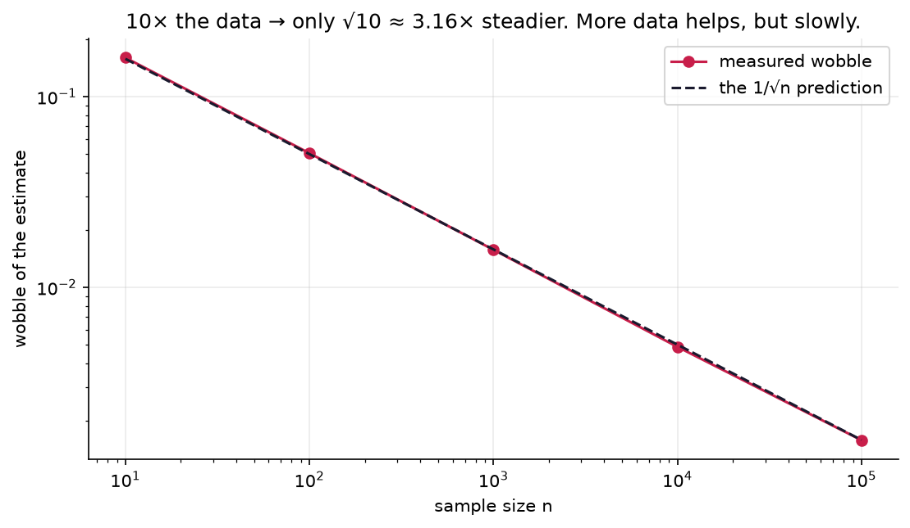

# 4.4 — Sampling & Randomness

*≤5 min read. Then straight to the worksheet.*

## Why this matters (the real reason)

Training a neural net is randomness all the way down: weights start at **random values**, data is
**shuffled** every epoch, each gradient step uses a random **minibatch** — a small sample standing
in for the whole dataset — and when an LLM generates text it **samples** the next token from a
probability distribution. Understanding *when a sample can be trusted* is understanding why
training works at all.

## The one big idea

You almost never get to measure the whole **population** (every possible image, all of English).
You get a **sample** — and use it to estimate the truth.

**Estimates from samples wobble. Bigger samples wobble less.**

Flip a fair coin 10 times: you might easily see 70% heads. Flip it 10,000 times: you'll be within
a whisker of 50%. Same coin, same method — the estimate *steadies* as $n$ grows. How fast? The
wobble shrinks like

$$\text{wobble} \propto \frac{1}{\sqrt{n}}$$

That square root is brutal and important: **10× more data only makes estimates ~3× steadier.**
It's why more data always helps, and why it helps less than you'd hope.



*Measured against theory, on log-log axes. The wobble of a coin-fraction estimate (dots) falls right
onto the $1/\sqrt n$ line (dashed) — a straight line on this plot, its slope encoding the square root
(Module 0.5's log scale doing the work). Going from 100 to 10,000 flips — 100× the data — steadies the
estimate only 10×. Diminishing returns, quantified.*

## Watch one get worked

*Poll A asks 100 people; 58% support X. Poll B asks 2,500 people; 52% support X. Which do you trust?*

**Step 1 — NAME population and sample.** Population: all voters. Samples: 100 and 2,500 people.

**Step 2 — COMPARE the wobble.** $\sqrt{2500}/\sqrt{100} = 50/10 = 5$ — Poll B is ~5× steadier.

**Step 3 — CHECK for bias.** Steadier only wins if the sample is *representative*. If Poll B
surveyed one suburb, its 2,500 answers are precise about the wrong population. **Bias doesn't
shrink with $n$** — a bigger biased sample is just more confidently wrong.

**Verdict:** trust B *if* both sampled fairly; the size gap swamps the 6-point difference.

## The Python connection

Randomness in code isn't haphazard — it's generated by an algorithm from a starting value, the **seed**:

```python
import numpy as np
rng = np.random.default_rng(42)      # 42 is the seed
print(rng.integers(1, 7, size=5))    # [1 4 4 3 6]

rng = np.random.default_rng(42)      # same seed →
print(rng.integers(1, 7, size=5))    # [1 4 4 3 6] — the SAME "random" numbers
```

Same seed → same sequence, forever, on any machine. That's why every experiment in this repo
starts with `default_rng(42)`: when a training run misbehaves, you can **replay it exactly**.
Reproducibility is a debugging superpower, not a footnote.

Two more places training uses randomness deliberately:

- **Shuffling** (`rng.shuffle(data)`): if data arrives sorted — all cats, then all dogs — each
  minibatch is a biased sample, and the net lurches instead of learning. Shuffling keeps every
  batch representative.
- **Temperature** (preview of Module 6.3): when sampling a token, LLMs can flatten or sharpen the
  distribution first. Low temperature → nearly always pick the top token (safe, repetitive);
  high → spread the bets (creative, chaotic). Sampling is a dial, not a fixed rule.

## The classic traps

- **"n = 1,000,000, so it must be right."** Size fixes wobble, never bias. Ask *how* it was
  sampled before asking how much.
- **Judging a coin from 10 flips.** 7 heads in 10 is unremarkable for a fair coin. Small samples
  produce dramatic-looking flukes constantly.
- **"It's seeded, so it's not really random."** For statistics, what matters is that the numbers
  *behave* like true randomness (they do, superbly). The seed just makes the run repeatable.
- (Here's 4.2's loose thread: numpy's `x.var()` divides by $n$, but a *sample* slightly
  underestimates the population's spread, so statisticians divide by $n-1$. At ML sample sizes
  the difference is negligible — know it exists, don't lose sleep.)

> **Deep-end question to hold during the worksheet:**
> a minibatch of 32 images gives a rough, wobbly estimate of the true gradient — yet nets trained
> on minibatches often generalise *better* than full-dataset training. Why might a bit of wobble
> be a feature, not a bug?

**Now: worksheet `04-sampling-and-randomness` — pen and paper. Then the notebook to watch
estimates steady as $n$ grows.**
