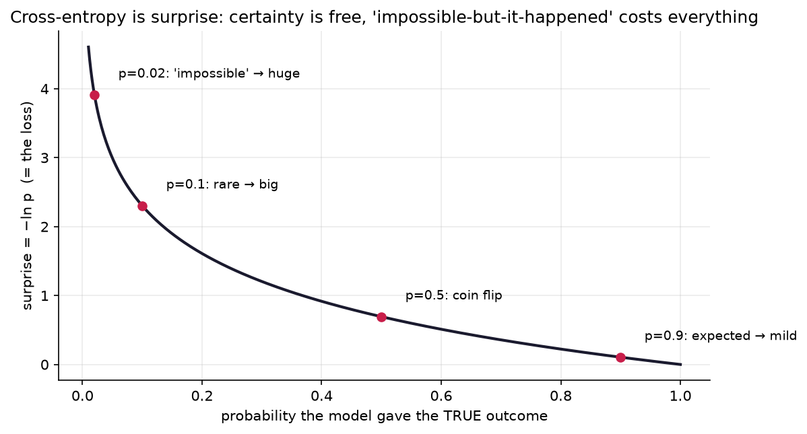
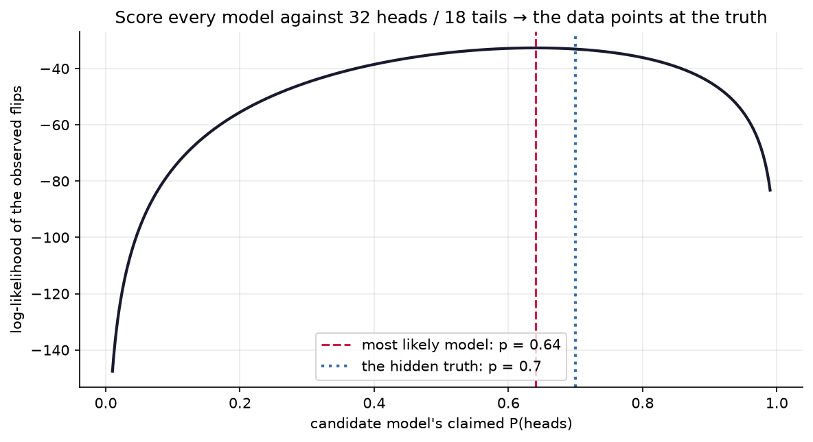

# 4.5 — Likelihood → Cross-Entropy

*≤5 min read. Then straight to the worksheet.*

## Why this matters (the real reason)

Open any classifier's training code and you'll find `loss = cross_entropy(...)` — the "weird" loss
nobody explains. Every LLM is trained by minimising it, token after token, trillions of times.
Here's the secret: it isn't weird at all. **Cross-entropy is just the negative log of the
probability the model gave the right answer.** By the end of this page you can compute it by hand.

## The one big idea

Flip the usual question around. Instead of *"given the coin, how likely is this data?"* ask:
*"given the data I saw, how good is this model?"*

**Likelihood = the probability a model assigns to the data you actually observed.**
Good model → high likelihood. That gives us a score to maximise.

*Example:* a model claims a coin lands heads with $p = 0.8$. You observe **H, H, T**.
Independent flips multiply:
$$L = 0.8 \times 0.8 \times 0.2 = 0.128$$

Two practical problems with products: thousands of them underflow to zero in a computer, and
calculus hates products. The fix is Module 0.5's log move — **logs turn × into +**:
$$\log L = \log 0.8 + \log 0.8 + \log 0.2$$

Then, because ML frameworks *minimise* losses rather than maximise scores, flip the sign.
**Negative log-likelihood ≡ cross-entropy.** That's the whole story:

$$\text{maximise } L \;\to\; \text{maximise } \log L \;\to\; \text{minimise } -\log L$$

The intuition that makes it stick: $-\log p$ is **surprise**.
- $p = 1$: $-\log 1 = 0$ — no surprise at all.
- $p = 0.5$: moderate surprise.
- $p \to 0$: surprise $\to \infty$ — you said this could never happen, and it happened.



*The shape of surprise, which is the shape of the loss. Give the true answer high probability (right
side) and you pay almost nothing. Give it a low probability and the cost climbs; call the truth
"impossible" ($p\to0$) and the loss rockets to infinity. This single curve, averaged over your data,
is cross-entropy — the loss training every classifier and LLM.*

Cross-entropy = **average surprise at the true answers**. Training a classifier = making the truth
unsurprising.

## Watch one get worked

*A classifier looks at a photo of a cat and outputs $[\text{cat: } 0.7,\ \text{dog: } 0.2,\ \text{bird: } 0.1]$. Cross-entropy?*

**Step 1 — PICK the truth's probability.** True label is cat → $p = 0.7$. The 0.2 and 0.1 play no
direct role; their crime was stealing probability from cat.

**Step 2 — LOG it.** $\ln 0.7 \approx -0.357$ (natural log; ML's default).

**Step 3 — NEGATE.** $\text{CE} = -\ln 0.7 \approx 0.357$. A little surprise — right answer,
modest confidence.

Compare a model that gave cat only 0.1: $-\ln 0.1 \approx 2.303$. And for a batch of images,
average the per-example values — that's the number on every training-loss curve you'll ever plot
($\text{loss} = \frac{1}{n}\sum -\ln p_i$ — one more Σ read as a for-loop).

## The Python connection

```python
import numpy as np

probs = np.array([0.7, 0.2, 0.1])       # model's output for one photo
true_class = 0                            # cat
print(-np.log(probs[true_class]))         # 0.3567 — cross-entropy, one line

# average surprise over a batch: truths were classes 0, 0, 2
p_truth = np.array([0.7, 0.9, 0.05])      # prob given to the RIGHT answer each time
print((-np.log(p_truth)).mean())          # one confident miss dominates the loss
```

`np.log` is the natural log ($\ln$). Notice the 0.05 case contributes 3.0 while the 0.9 case
contributes 0.1 — **confidently wrong costs far more than humbly right earns**. That asymmetry is
the loss *teaching calibration*.

## The classic traps

- **$\log(0) = -\infty$.** If a model assigns the true class exactly 0, its loss is infinite.
  This is why networks output probabilities via softmax that never quite reach 0 or 1.
- **Adding probabilities of independent events.** Independent observations *multiply*
  (that's what made logs useful in the first place).
- **"Lower loss = more accurate."** Mostly, but not identically: cross-entropy also punishes
  overconfidence. A model can get more accurate while its loss worsens — it's becoming a
  confident gambler.
- **Base confusion.** ML uses $\ln$; information theory uses $\log_2$ (measured in bits).
  Same idea, constant factor apart. Pick one and say which.

> **Deep-end question to hold during the worksheet:**
> a 10-class model that shrugs — $p = 0.1$ for everything — scores $-\ln 0.1 \approx 2.303$ on
> every example. Untrained networks start almost exactly there. Why is $\ln(\text{number of
> classes})$ the "knows nothing" score, and what would a loss *above* it tell you?



*Likelihood finding a hidden bias by itself. A coin with secret $p=0.7$ was flipped 50 times; we score
**every** candidate model by the log-likelihood of what we saw. The peak (dashed) sits at 0.64 — the
sample's own fraction of heads — landing **near** the true 0.7 but not exactly on it, because 50 flips
still wobble (Module 4.4). More flips, sharper peak, closer to 0.7. "Training" is climbing this hill.*

**Now: worksheet `05-likelihood-cross-entropy` — pen and paper. Then the notebook, where you'll
watch likelihood find a hidden coin's bias all by itself.**
