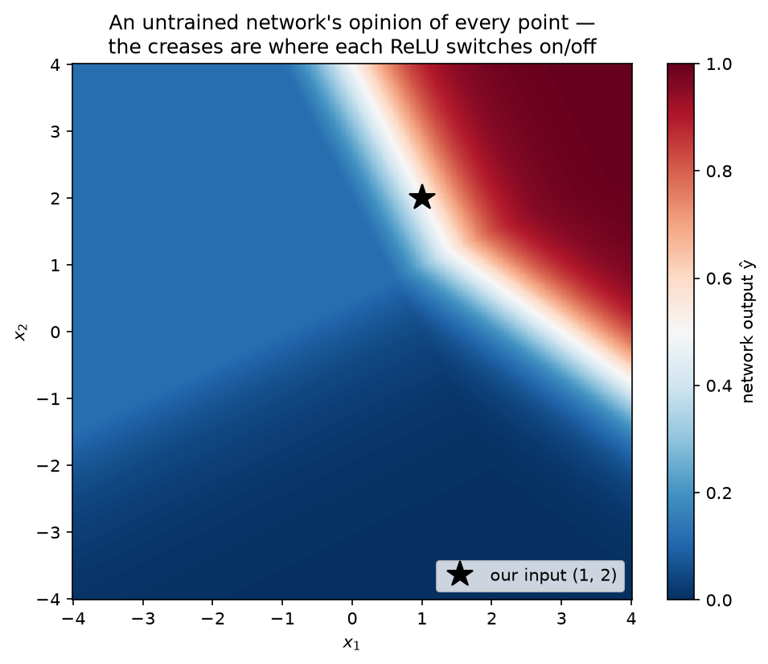

# 5.1 — The Forward Pass: a Network Is Just Composed Functions

*≤5 min read. Then straight to the worksheet.*

## Why this matters (the real reason)

This module is the payoff for everything since Module 0. Here's the secret the textbooks bury:
**you already know every piece of math inside a neural network.** A "layer" is a matrix
multiplication (Module 2.5) plus a shift (Module 1.3) fed through a squashing function
(Module 1.5). A "deep network" is those layers **composed** — machines feeding machines,
exactly Module 1.4. Today you hand-trace a real network on paper and discover there's no magic
in the box.

## The one big idea

**One layer = multiply, shift, squash:**

$$\mathbf{h} = f(W\mathbf{x} + \mathbf{b})$$

| Piece | What it is | Where you learned it |
|---|---|---|
| $W\mathbf{x}$ | matrix × vector — each row of $W$ takes a **dot product** with $\mathbf{x}$ | Module 2.3, 2.5 |
| $+\,\mathbf{b}$ | the bias — shifts the result, like shifting a graph | Module 1.3 |
| $f(\cdot)$ | the activation — a nonlinear squash, applied to each number | Module 1.5 |

**A network = layers composed.** Two layers is just $\;\hat{y} = f_2(W_2 \, f_1(W_1\mathbf{x} + \mathbf{b}_1) + \mathbf{b}_2)$ — Module 1.4's $g(f(x))$, wearing a trench coat.

Running an input through this pipeline is called the **forward pass**.

## Watch one forward pass, by hand

Our network for this whole module: **2 inputs → 2 hidden neurons → 1 output**. Activations:
**ReLU** in the middle ($\text{ReLU}(z) = \max(0, z)$ — negative becomes 0, positive passes through),
**sigmoid** at the end ($\sigma(z) = \frac{1}{1+e^{-z}}$ — squashes anything into a probability between 0 and 1).

Input and weights:

$$\mathbf{x} = \begin{pmatrix} 1 \\ 2 \end{pmatrix}, \quad
W_1 = \begin{pmatrix} 0.5 & -1 \\ 1 & 0.5 \end{pmatrix}, \quad
\mathbf{b}_1 = \begin{pmatrix} 0.5 \\ -1 \end{pmatrix}, \quad
W_2 = \begin{pmatrix} -1 & 2 \end{pmatrix}, \quad
b_2 = -2$$

**Step 1 — matrix multiply (Module 2.5):** each row of $W_1$ dot-products with $\mathbf{x}$.

$$W_1\mathbf{x} = \begin{pmatrix} 0.5(1) + (-1)(2) \\ 1(1) + 0.5(2) \end{pmatrix} = \begin{pmatrix} -1.5 \\ 2 \end{pmatrix}$$

**Step 2 — add the bias (Module 1.3's shift):**

$$\mathbf{z}_1 = W_1\mathbf{x} + \mathbf{b}_1 = \begin{pmatrix} -1.5 + 0.5 \\ 2 + (-1) \end{pmatrix} = \begin{pmatrix} -1 \\ 1 \end{pmatrix}$$

**Step 3 — activation (ReLU, each entry separately):**

$$\mathbf{h} = \text{ReLU}(\mathbf{z}_1) = \begin{pmatrix} \max(0,-1) \\ \max(0,1) \end{pmatrix} = \begin{pmatrix} 0 \\ 1 \end{pmatrix}$$

The first hidden neuron went negative and ReLU **switched it off**. Remember that 0 — it matters in lesson 5.3.

**Step 4 — second layer, same three moves:**

$$z_2 = W_2\mathbf{h} + b_2 = (-1)(0) + 2(1) + (-2) = 0$$

**Step 5 — output activation (sigmoid):**

$$\hat{y} = \sigma(0) = \frac{1}{1+e^{0}} = \frac{1}{2} = 0.5$$

The network's answer: **0.5** — a fifty-fifty shrug. It hasn't learned anything yet (the weights
are arbitrary). Making that answer *better* is the rest of this module.



*The same forward pass, run at **every** point of the plane at once — the network's current "opinion"
everywhere (blue ≈ 0, red ≈ 1). Two things to see: the output has **straight creases**, each one exactly
where a ReLU flips on or off (the kinks from Module 1.5), and right now the map is arbitrary nonsense —
our input (the star) sits on a boundary at 0.5. Training reshapes this whole surface.*

## The Python connection

The entire forward pass is four lines of numpy — and you know what every one does:

```python
z1 = W1 @ x + b1          # @ is numpy's matrix-multiply operator (Module 2.5)
h  = np.maximum(0, z1)    # ReLU: elementwise max against 0
z2 = W2 @ h + b2
y_hat = 1 / (1 + np.exp(-z2))   # sigmoid (Module 1.5)
```

That's it. GPT is this, repeated a few thousand times with bigger matrices.

## The classic traps

- **Shape errors.** $W_1$ is $2{\times}2$ and $\mathbf{x}$ is $2{\times}1$ → out comes $2{\times}1$.
  Module 2.5's rule: *(m×n)(n×1) → (m×1)* — inner numbers must match. Check shapes before multiplying, every time.
- **Forgetting the activation.** Without $f$, two layers collapse into one:
  $W_2(W_1\mathbf{x}) = (W_2 W_1)\mathbf{x}$ — just another single matrix. The nonlinearity is what makes *deep* mean something.
- **Bias amnesia.** $W\mathbf{x}$ alone always sends $\mathbf{0} \to \mathbf{0}$. The bias is what lets a neuron fire on zero input.

> **Deep-end question to hold in your head during the worksheet:**
> ReLU switched off hidden neuron 1 for *this* input. Is that neuron useless, or just useless
> *for this input*? What kind of input would wake it up?

**Now: worksheet `01-forward-pass` — pen and paper. Photograph it into `scans/inbox/` when done.**
