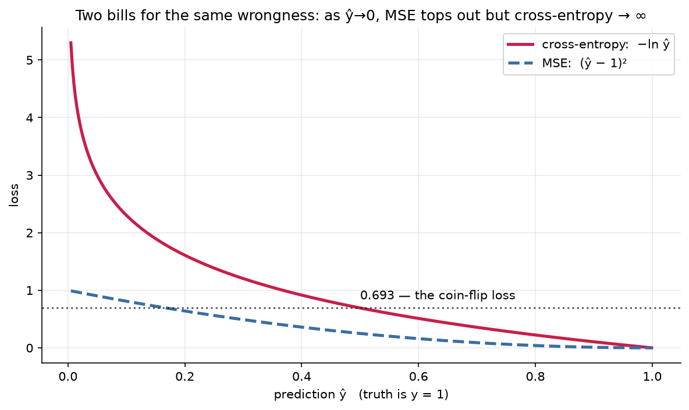
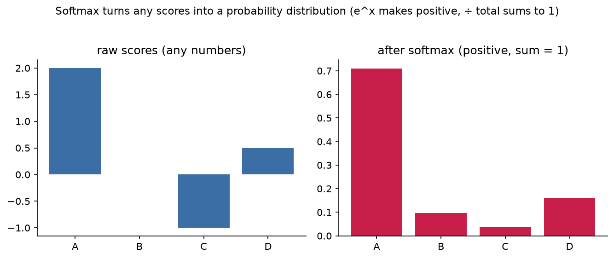

# 5.2 — How Wrong Are We? Loss Functions

*≤5 min read. Then straight to the worksheet.*

## Why this matters (the real reason)

In 5.1 your network answered $\hat{y} = 0.5$ when the truth was $y = 1$. Is that bad? *How* bad?
Learning needs a single number that measures wrongness — a **loss** — because "make this number
smaller" is a job gradient descent (Module 3.5) knows how to do. Choose the loss well and
its gradients point the way; choose badly and training crawls. This is where Module 4.5's
likelihood work pays off in full.

## The one big idea

**A loss function scores one prediction against one truth. Small = good, zero = perfect.**

Two losses cover most of deep learning:

**1. Mean squared error (MSE) — for predicting numbers** (house prices, temperatures):

$$L = (\hat{y} - y)^2$$

Miss by 2 → pay 4. Miss by 3 → pay 9. Squaring keeps it positive and punishes big misses hardest —
it's the "distance squared" you met with vectors in Module 2.2.

**2. Cross-entropy — for predicting probabilities** (cat or dog, spam or not):

$$L = -\big[\, y \ln \hat{y} + (1-y)\ln(1-\hat{y}) \,\big]$$

Looks scary; isn't. $y$ is either 1 or 0, so **one of the two terms is always zero**:

- if $y = 1$: $\;L = -\ln \hat{y}$ — pay the negative log of the probability you gave the *right* answer
- if $y = 0$: $\;L = -\ln(1-\hat{y})$ — same idea, mirrored

This is exactly Module 4.5: cross-entropy **is** negative log-likelihood. "Maximise the probability
of the truth" and "minimise cross-entropy" are the same sentence.

Why the log (Module 0.5)? Because $-\ln$ turns confidence into a fair bill:
confident and right ($\hat{y}=0.99$) → $L = 0.01$, nearly free. Confident and **wrong**
($\hat{y}=0.01$ when $y=1$) → $L = 4.6$, brutal. The log makes overconfident wrongness catastrophically
expensive — precisely the behaviour we want to train away.



*Two ways to bill the same wrongness. When the network is **confidently wrong** (ŷ→0 while the truth is
1), MSE politely tops out near 1 — a weak complaint, and a weak gradient right when you need a loud one.
Cross-entropy heads for **infinity**. That steep wall is exactly the teaching signal that makes
classifiers learn, and why cross-entropy — not MSE — is the loss for probabilities.*

## Score our network, by hand

From 5.1: $\hat{y} = 0.5$, truth $y = 1$.

**Step 1 — pick the branch:** $y = 1$, so $L = -\ln \hat{y}$.

**Step 2 — substitute:** $L = -\ln(0.5)$.

**Step 3 — evaluate (log laws, Module 0.5):** $-\ln(0.5) = \ln 2 \approx 0.693$.

**0.693 is the coin-flip loss** — the score for total ignorance on a yes/no question. Every binary
classifier ever trained starts life near 0.693 and earns its way down. When you see a training-loss
curve start at 0.69 in the wild, you now know why.

Compare: had the network said $\hat{y} = 0.9$, the loss would be $-\ln(0.9) \approx 0.105$.
Had it said $\hat{y} = 0.1$: $-\ln(0.1) \approx 2.303$. Same wrongness scale you'd want as a bookmaker.

## Softmax — a preview

Our network outputs *one* probability. Real classifiers pick between many classes (1000 dog breeds).
They output one raw **score** per class, then convert scores → probabilities with **softmax**:

$$p_i = \frac{e^{s_i}}{\sum_j e^{s_j}}$$

Module 0.5's $e^x$ makes every score positive, Module 0.6's $\Sigma$ divides by the total so they
sum to 1. Scores $(2, 0)$ → $\left(\frac{e^2}{e^2+e^0}, \frac{e^0}{e^2+e^0}\right) \approx (0.88, 0.12)$.



*Softmax, drawn. Four raw scores — any numbers, even negative — go in; four probabilities that sum to 1
come out. $e^x$ lifts everything positive (biggest score stays biggest), then dividing by the total
normalises (Module 0.4). This is the exact output stage of every classifier, GPT included.*
Then cross-entropy charges $-\ln(p_{\text{correct}})$, same as today. That's the entire output end
of GPT. Full story in Module 6.

## The Python connection

```python
loss = -np.log(y_hat)              # cross-entropy when the true label is 1
loss = -np.log(1 - y_hat)          # ...when the true label is 0
mse  = (y_hat - y)**2              # MSE, for comparison
```

`np.log` is the natural log, $\ln$ — base $e$, like everywhere in ML.

## The classic traps

- **$\ln(0)$ is $-\infty$.** If your network ever outputs exactly 0 or 1, cross-entropy explodes.
  (Sigmoid never quite reaches them — one reason it's the right partner.)
- **Dropping the minus sign.** $\ln(0.5)$ is *negative*; the minus flips it to a positive penalty.
  A "negative loss" on your screen usually means this sign went missing.
- **MSE on probabilities.** It works, badly: its gradients go flat exactly when the network is
  confidently wrong — the moment you most need a loud gradient. Cross-entropy stays loud (5.3 shows why).

> **Deep-end question to hold in your head during the worksheet:**
> your network says $\hat{y}=0.5$ for *every* input, no matter what. Its loss is a steady 0.693.
> Is there any yes/no dataset where you literally cannot beat that? What would the data have to look like?

**Now: worksheet `02-loss-cross-entropy` — pen and paper. Photograph it into `scans/inbox/` when done.**
