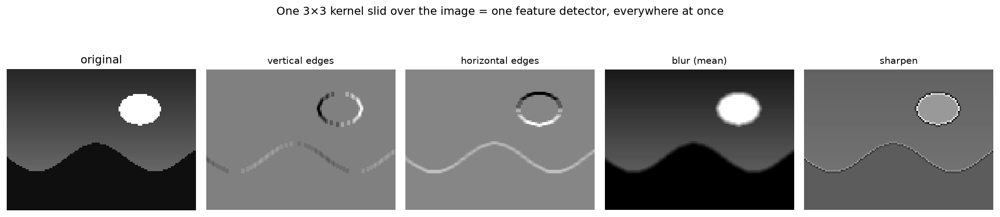
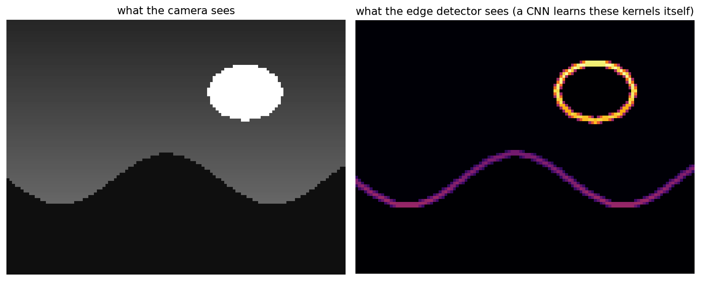

# 5.5 — Convolutions: a Dot Product Goes for a Walk

*≤5 min read. Then the worksheet, then the notebook — the pictures are worth it.*

## Why this matters (the real reason)

Your network from 5.1–5.4 treats every input number independently. Images don't work like that:
a pixel means something because of its **neighbours** — edges, corners, textures. Computer vision's
answer is the **convolution**: one small grid of weights, slid across the whole image, taking a
dot product (Module 2.3) at every stop. It's the C in CNN, the operation that reads X-rays and
drives cars — and after Module 2.6 (images ARE matrices), you already know both ingredients.

## The one big idea

**A convolution slides a small weight-matrix (the *kernel*) over an image. At each position:
lay the kernel on the patch beneath it, multiply matching entries, add them all up** — a dot
product between the kernel and that patch (Modules 2.3 + 0.6). Each stop writes one number into
the output image, called a **feature map**.

Same weights, every location — one tiny detector asked "are you here? here? here?" everywhere.
That's why a kernel can find an edge *anywhere* in the image with just 9 numbers.

## Hand-compute one, fully

A $5{\times}5$ image — bright square (1s) on the left, dark (0s) on the right — and a $3{\times}3$
**vertical-edge kernel**:

$$I = \begin{pmatrix}
1 & 1 & 1 & 0 & 0 \\
1 & 1 & 1 & 0 & 0 \\
1 & 1 & 1 & 0 & 0 \\
1 & 1 & 1 & 0 & 0 \\
1 & 1 & 1 & 0 & 0
\end{pmatrix}
\qquad
K = \begin{pmatrix}
1 & 0 & -1 \\
1 & 0 & -1 \\
1 & 0 & -1
\end{pmatrix}$$

Read $K$'s design like a why-first detective: it computes **(left column) − (right column)** of
whatever patch it sits on. Brightness the same on both sides → 0. Bright left, dark right → big
positive. It literally *is* the question "does brightness drop, left to right, right here?"

**Position (top-left).** Kernel covers rows 1–3, columns 1–3 — all 1s:

$$\underbrace{1{\cdot}1 + 1{\cdot}0 + 1{\cdot}(-1)}_{\text{row 1}} + \underbrace{1{\cdot}1 + 1{\cdot}0 + 1{\cdot}(-1)}_{\text{row 2}} + \underbrace{1{\cdot}1 + 1{\cdot}0 + 1{\cdot}(-1)}_{\text{row 3}} = 0$$

Flat patch → the detector stays silent. **Named move: dot product of kernel and patch (Module 2.3).**

**Slide one column right.** The patch is now columns 2–4 of the image: left column 1s, right column 0s:

$$3(1{\cdot}1) + 3(1{\cdot}0) + 3(0 \cdot (-1)) = 3 + 0 + 0 = 3$$

The edge is under the kernel → the detector shouts **3**.

**Slide again** (columns 3–5): left column 1s, right column 0s again → **3**. Every row is identical,
so the full output (a $3{\times}3$ feature map — see the traps for why it shrank) is:

$$I * K = \begin{pmatrix}
0 & 3 & 3 \\
0 & 3 & 3 \\
0 & 3 & 3
\end{pmatrix}$$

The output is dark exactly where the image is flat and bright where the edge lives. **A convolution
turns "where is the edge?" into arithmetic.** Rotate the kernel 90° and it finds horizontal edges;
in a real CNN, training *learns* the kernel entries by backprop (5.3) — edge detectors emerge on their own.



*The same 3×3-kernel trick on a real scene. **Vertical-edge** lights up the sun's left/right sides;
**horizontal-edge** catches the ridge and the sun's top/bottom; **blur** is the ⅑-mean (Module 4.2's
average) smearing detail; **sharpen** exaggerates every boundary. Four detectors, each just nine numbers
slid across the image.*



*Combine the vertical and horizontal edge maps as a vector length (Module 2.1's Pythagoras at every
pixel) and the scene collapses to **pure structure** — the sun's rim and the ridge, glowing. A CNN's
first layer learns kernels like these *by itself* through backprop, then feeds their outputs to more
kernels: features of features. That stack is how a network reads an X-ray or drives a car.*

## The Python connection

Two honest loops — no libraries hiding the idea:

```python
out = np.zeros((3, 3))
for i in range(3):                      # each output row
    for j in range(3):                  # each output column
        patch = I[i:i+3, j:j+3]         # slicing (Module 2.6): the 3x3 window at (i, j)
        out[i, j] = np.sum(patch * K)   # elementwise multiply then sum = dot product
```

`patch * K` multiplies matching entries; `np.sum` adds them — Module 0.6's $\Sigma$ in the flesh.

## The classic traps

- **The output shrinks.** A $3{\times}3$ kernel on a $5{\times}5$ image has only $3{\times}3$ valid
  positions: $(5-3+1)$ each way. General rule: $n - k + 1$. (Real CNNs often pad the border with
  zeros to keep the size.)
- **Sliding past the edge.** The kernel must fit entirely on the image — position $(1, 4)$ doesn't exist.
- **Mixing up kernel and patch orientation.** Multiply *matching* positions — top-left with top-left.
  Line the grids up before you multiply; most hand-arithmetic errors here are alignment slips.

> **Deep-end question to hold in your head during the worksheet:**
> what does the all-$\frac{1}{9}$ kernel $\begin{pmatrix} \frac19 & \frac19 & \frac19 \\ \frac19 & \frac19 & \frac19 \\ \frac19 & \frac19 & \frac19 \end{pmatrix}$ do to an image?
> (Hint: what statistic from Module 4.2 is "add nine things, divide by nine"?)

**Now: worksheet `05-convolutions` — pen and paper, photograph into `scans/inbox/`. Then the boss awaits.**
