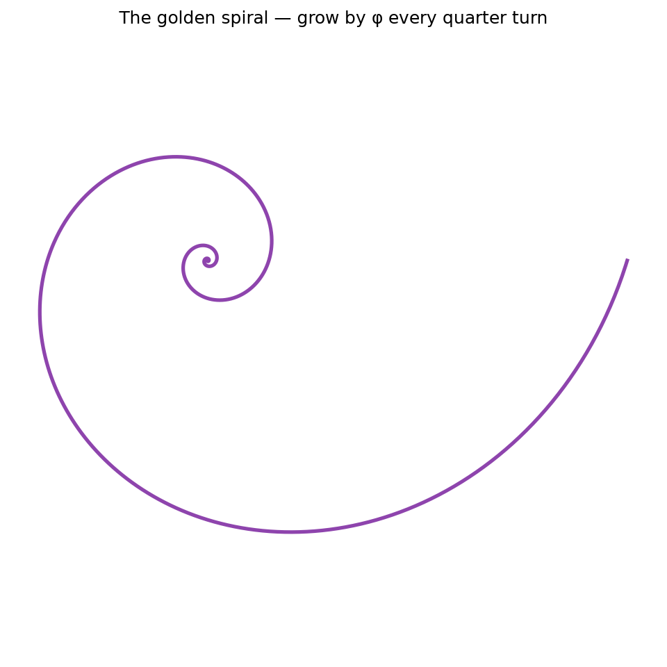
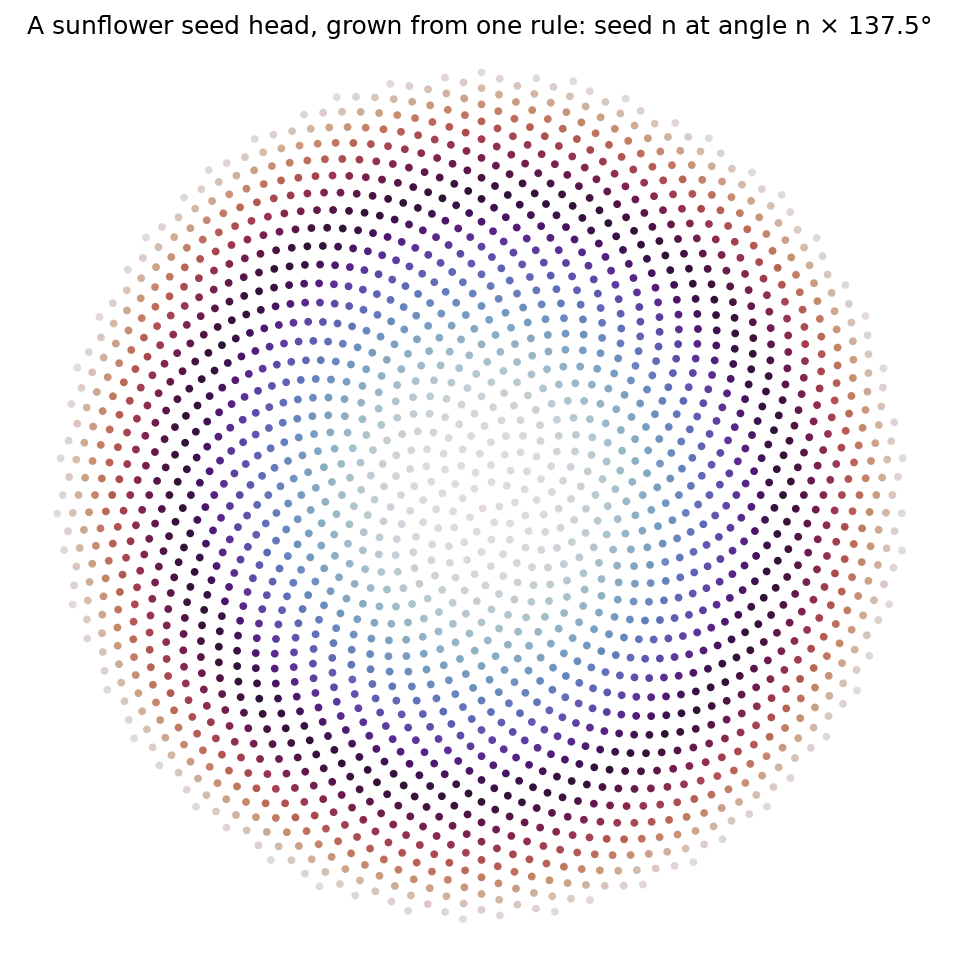

# Interlude I.1 — Fibonacci & the Golden Ratio

*You beat the Module 0 boss. This is your reward: no worksheet, no marking — just wonder. ~30 min.*

## The hook

In 1202, a man counting rabbits wrote down the laziest rule in mathematics:
*each number is the sum of the two before it.*

$$F(n) = F(n-1) + F(n-2)$$

1, 1, 2, 3, 5, 8, 13, 21, 34, 55…

That's it. No trick. And yet hiding inside this sequence is a number —
$\varphi = \frac{1+\sqrt{5}}{2} \approx 1.618$, the **golden ratio** — that nature has been
quietly using for a billion years: sunflower seed heads, pinecones, nautilus shells,
the arms of spiral galaxies.

## What you're about to do

- Build the sequence with a Python loop (you just learned recurrences — this is one).
- Divide each number by the one before it and watch the ratios *home in* on φ like a guided missile.
- Draw the golden spiral with your own code.
- Then the showstopper: grow a **sunflower seed head** from one rule —
  seed $n$ goes at radius $\sqrt{n}$, angle $n \times 137.5°$ — and watch a real
  flower appear on your screen.

Here's where you're headed — build these yourself, don't just admire mine:

*The spiral grows by φ every quarter-turn; the flower places each seed 137.5° further round than the
last. One number, the golden angle, and a **sunflower** appears — the same pattern nature uses because
φ is the hardest number to approximate with a fraction, so seeds never line up and waste space.*

**Open the notebook: `01-fibonacci-golden-ratio.ipynb`. Build it yourself.**

---

> **To hold in your head while you play:** 137.5° is the "golden angle" — the full circle
> divided by φ. Mathematicians can prove φ is *the most irrational number that exists*,
> the one hardest to approximate with fractions. That's exactly why sunflowers use it:
> any "nicer" angle would make the seeds line up in spokes and waste space.
> The flower found the optimal number by evolution. You're about to find it with a for-loop.
