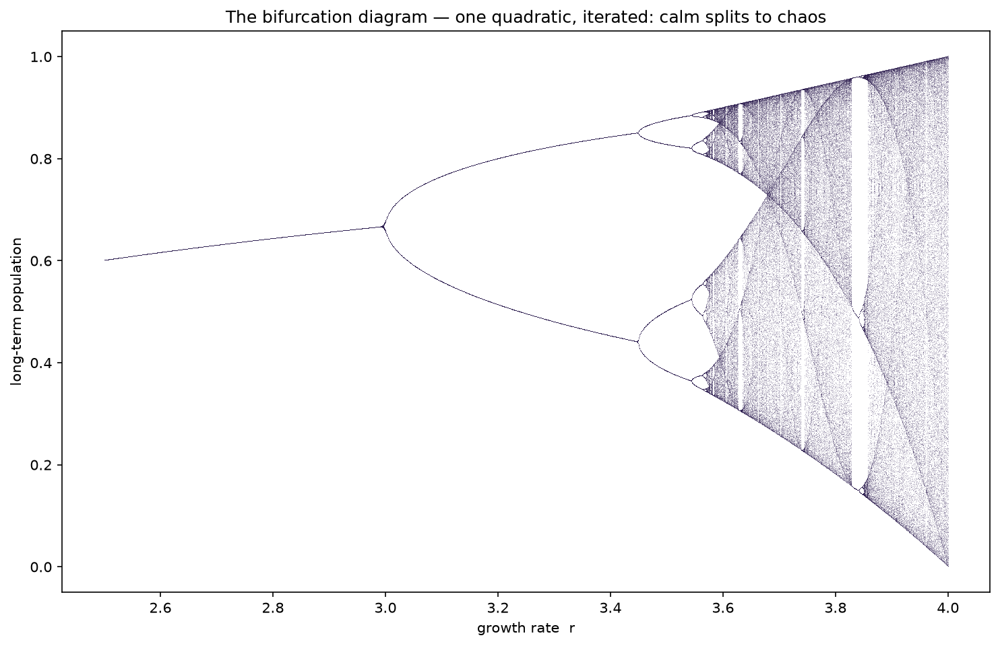
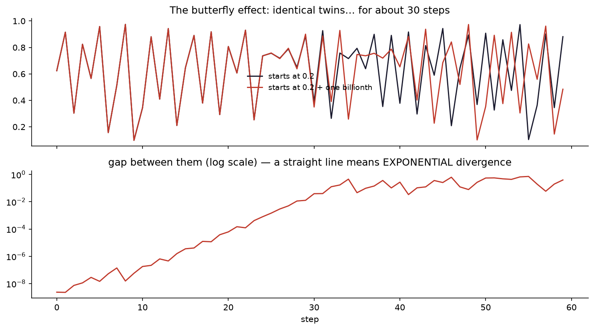

# Interlude I.2 — The Logistic Map & the Edge of Chaos

*Module 1 boss: down. Reward time. ~30 min, pure wonder.*

## The hook

You've just spent a module learning functions and how to compose them.
Here is a single, innocent-looking quadratic:

$$x_{n+1} = r \, x_n \, (1 - x_n)$$

It models a population: $x$ is this year's population (as a fraction of the maximum),
$r$ is the growth rate. Feed each year's output back in as next year's input —
a function composed *with itself*, over and over.

For small $r$, the population settles down. Boring. Then you turn $r$ up a little…
and the settling **splits in two**. Turn it up more — four. Then eight. Then, at
$r \approx 3.57$, the population never repeats itself again. Ever. That's **chaos** —
born from one quadratic you could solve in your sleep.

## What you're about to do

- Iterate the rule by hand-in-Python and watch stable → oscillating → chaos.
- Render the **bifurcation diagram** — the family tree of chaos, and honestly one of
  the most beautiful images in all of mathematics. Your code, ~15 lines.
- Run the **butterfly effect**: two populations that differ by 0.000000001 at the start,
  completely unrecognisable from each other within 40 steps.

The destination — one of the most beautiful images in mathematics, and it's ~15 lines of your code:

*Read it left to right as you turn up the growth rate $r$: one stable population, then it **splits**
(2 values it flips between), splits again (4), again (8), faster and faster — then at $r\approx3.57$ it
shatters into **chaos**. Look closely and there are pale vertical "windows" where order briefly returns.
All from $x \to rx(1-x)$.*

*The butterfly effect: two starts a **billionth** apart stay identical for ~30 steps, then diverge
completely. The lower panel shows why — the gap grows exponentially (a straight line on Module 0.5's log
scale). This is chaos: not randomness, but total sensitivity to where you began.*

**Open the notebook: `02-logistic-map-chaos.ipynb`.**

---

> **To hold in your head:** the doubling you'll see (1 → 2 → 4 → 8 branches) happens at a
> universal rhythm — each split comes ~4.669× faster than the last. That number, Feigenbaum's
> constant, shows up in dripping taps, fibrillating hearts and boiling water. Nobody chose it.
> It was *found*, the way explorers find rivers. Whose number is it?
