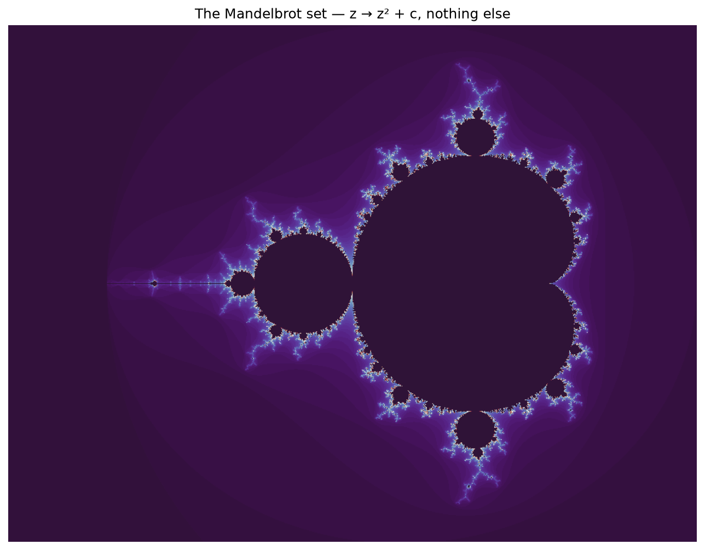
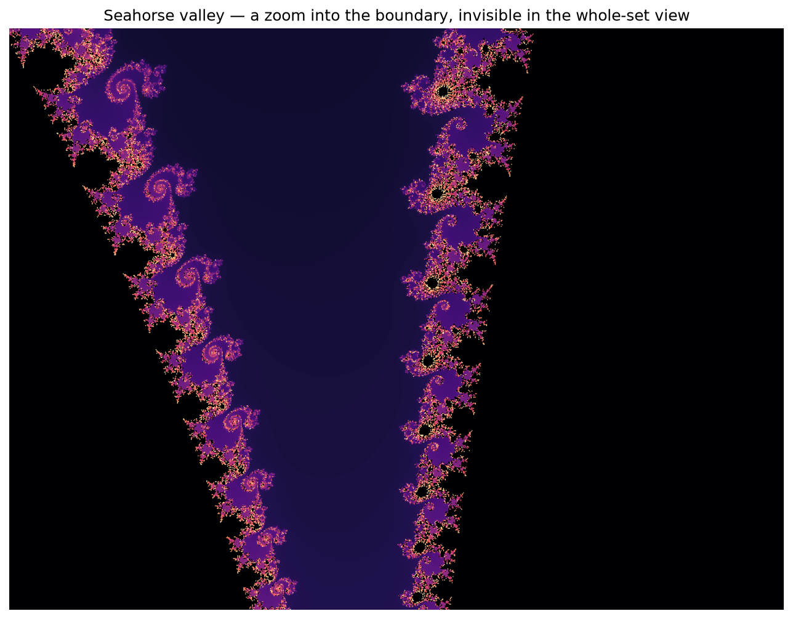

# Interlude I.3 — The Mandelbrot Set

*The Module 2 boss is beaten. You've earned the big one. ~30 min.*

## The hook

Back in Module 0, at the end of your very first notebook, you ran some mystery code and a
strange black-and-blue creature appeared. You were promised that one day you'd build it
yourself and understand every line.

Today is that day.

You now know that a vector is a point AND an arrow, and that some operations *rotate and
scale* the plane. Complex numbers are exactly that: 2D vectors with a built-in rotation
twist — multiplying by one rotates and scales in a single move. The whole rule is:

$$z \;\to\; z^2 + c$$

Square, add, repeat. For each point $c$ in the plane, iterate and ask one question:
*does $z$ stay close to home, or fly off to infinity?* Colour the point by the answer.

## What you're about to do

- Meet complex numbers gently — Python has them built in (`3+4j`), and you already
  think in 2D vectors.
- Iterate $z^2 + c$ by hand for two points: one loyal, one escapee.
- Render the full set with numpy — no pixel-by-pixel loops, whole-grid thinking.
- Then **zoom into the boundary** and watch new worlds appear: seahorses, spirals,
  baby Mandelbrots — detail that literally never ends.

The creature you were promised in Module 0 — and this time you'll understand every line that makes it:

*Colour each point $c$ by how long $z\to z^2+c$ takes to fly off to infinity, and **this** appears —
from seven characters of maths. Then zoom into the boundary (right) and new worlds unfold: seahorse
tails, spirals, tiny perfect copies of the whole set. The detail never ends, no matter how far you zoom.
In the notebook you steer the expedition.*

**Open the notebook: `03-mandelbrot.ipynb`.**

---

> **To hold in your head:** the boundary of this set is *infinitely* intricate — zoom in
> a billion times and it is still not smooth, still sprouting new structure, including
> perfect miniature copies of itself. Mathematicians call it the most complex object in
> mathematics. Its complete definition is the seven characters you see above: $z^2 + c$.
