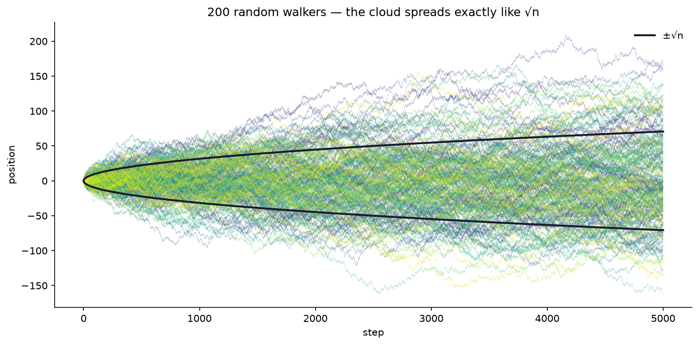
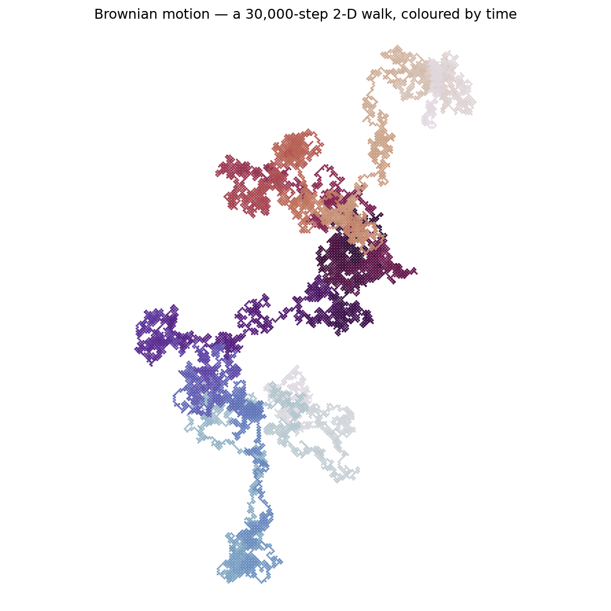

# Interlude I.4 — Random Walks & Brownian Motion

*Module 3 boss: defeated. You taught code to descend a gradient. Now watch code wander. ~30 min.*

## The hook

Flip a coin. Heads: step right (+1). Tails: step left (−1). Keep a running total.

$$x_n = x_{n-1} + \text{step}_n, \qquad \text{step}_n \in \{-1, +1\}$$

That running total — a cumulative sum of pure noise — is a **random walk**, and it is one
of the most important objects in science. It's pollen grains jittering in water (the
observation that convinced the world atoms were real), it's stock prices, it's molecules
of perfume crossing a room, and — this is the part that should give you chills — it's the
mathematical ancestor of how **diffusion models paint images out of noise**.

## What you're about to do

- Flip coins with numpy, take a cumulative sum (`np.cumsum` — a Σ that keeps its receipts),
  and watch a path wander.
- Release **200 walkers** at once and see the cloud spread out — not at random, but at a
  precise, provable rate: after $n$ steps, typical distance $\approx \sqrt{n}$.
- Set walkers loose in 2D and draw Brownian motion — paths that look hand-drawn by nature.

Where you're headed — pure noise, yet with a precise, provable shape:

*Left: release 200 walkers and the cloud spreads — not lawlessly, but at exactly $\pm\sqrt{n}$ (Module
4.4's √n law, the same square root that governs sample wobble). Right: a 2-D walk is **Brownian motion**
— the jitter of pollen in water that proved atoms exist, and the mathematical ancestor of how diffusion
models paint images from noise, run backwards.*

**Open the notebook: `04-random-walks.ipynb`.**

---

> **To hold in your head:** a diffusion model generates an image by learning to run this
> wandering *backwards* — starting from pure noise and un-walking it, step by step, into a
> picture. And gradient descent with noisy batches — the thing you built last module — is
> itself a random walk drifting downhill. Randomness isn't the opposite of structure.
> It's where structure comes from.
