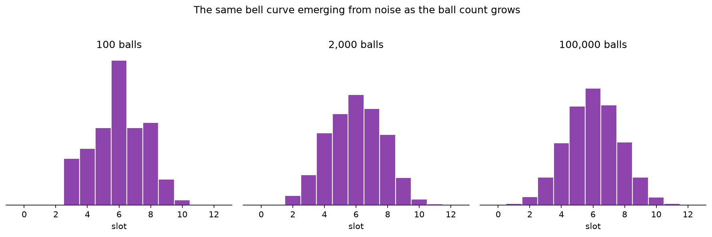
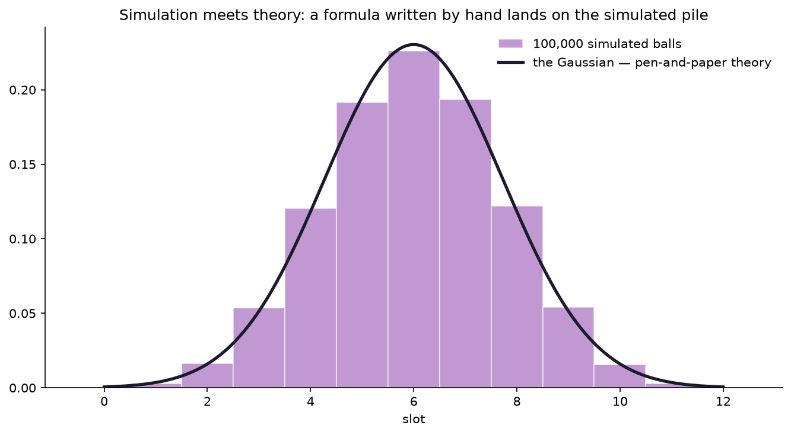

# Interlude I.5 — The Galton Board: Order from Chaos

*Module 4 boss: done. One reward left before the capstones — the deepest one. ~30 min.*

## The hook

Drop a ball onto a triangle of pegs. At every peg it bounces left or right — a coin flip.
After a dozen rows it lands in a slot. One ball: completely unpredictable.
Ten thousand balls: **the same curve, every single time.**

$$\text{slot} = \sum_{i=1}^{12} \text{bounce}_i$$

A sum of coin flips. That's all a Galton board is. And out of that pure randomness rises
the bell curve — the Gaussian — as reliably as the sun. This is the **central limit
theorem**: add up enough independent random nudges, of almost *any* kind, and their sum
always takes the same bell shape. Randomness has laws, and you're about to watch one
get enforced.

## What you're about to do

- Simulate one ball, then 100, then 100,000 — no physics engine, just numpy coin flips.
- Watch the histogram sharpen from noise into the bell as the ball count grows.
- Then the money shot: overlay the **theoretical normal curve** — a formula written by
  mathematicians with pen and paper — on your simulated pile. They will match. Eerily.

The reward you're building — order rising visibly out of pure chance:

*Left: one ball is unpredictable, but as the count grows the pile sharpens into the **same bell every
time**. Right: overlay the Gaussian a mathematician derived by hand — μ = 6, σ = √3 — and it lands right
on your simulated pile. That's the central limit theorem (Module 4.3) enforced in front of you: a sum of
coin flips *always* becomes this curve.*

**Open the notebook: `05-galton-board.ipynb`.**

---

> **To hold in your head:** heights, measurement errors, sensor noise, exam marks — the
> Gaussian is everywhere because *everything* in nature is a sum of many small independent
> nudges, and the CLT says all such sums converge to the same shape. That's why diffusion
> models are built on Gaussian noise: it isn't a convenient choice, it's the shape
> randomness itself settles into. One curve rules them all — and tonight it works for you.
